# The evolution of communication, computing and user experience

---

# Computing as problem-solving

## Computing started as *problem-solving*, not machines.

---

## (Prehistory 300.000 B.C. → Ancient Times 3200 B.C.)

<div class="container-images">
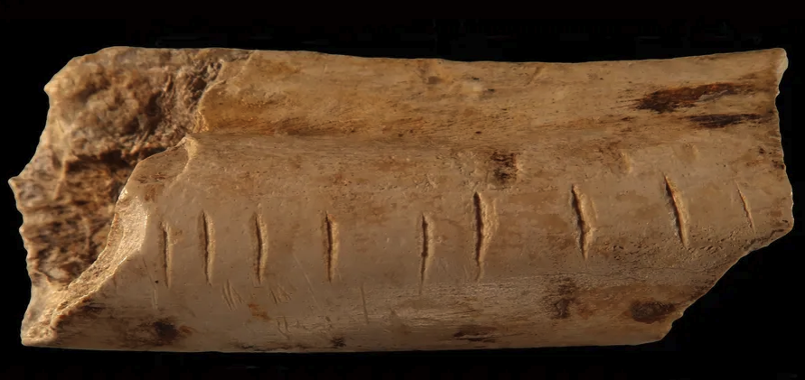
</div>

Humans had to rely on their biological memory or make marks on sticks

---

## Calculation (3200 B.C to 1600 A.C.)

<div class="container-images">
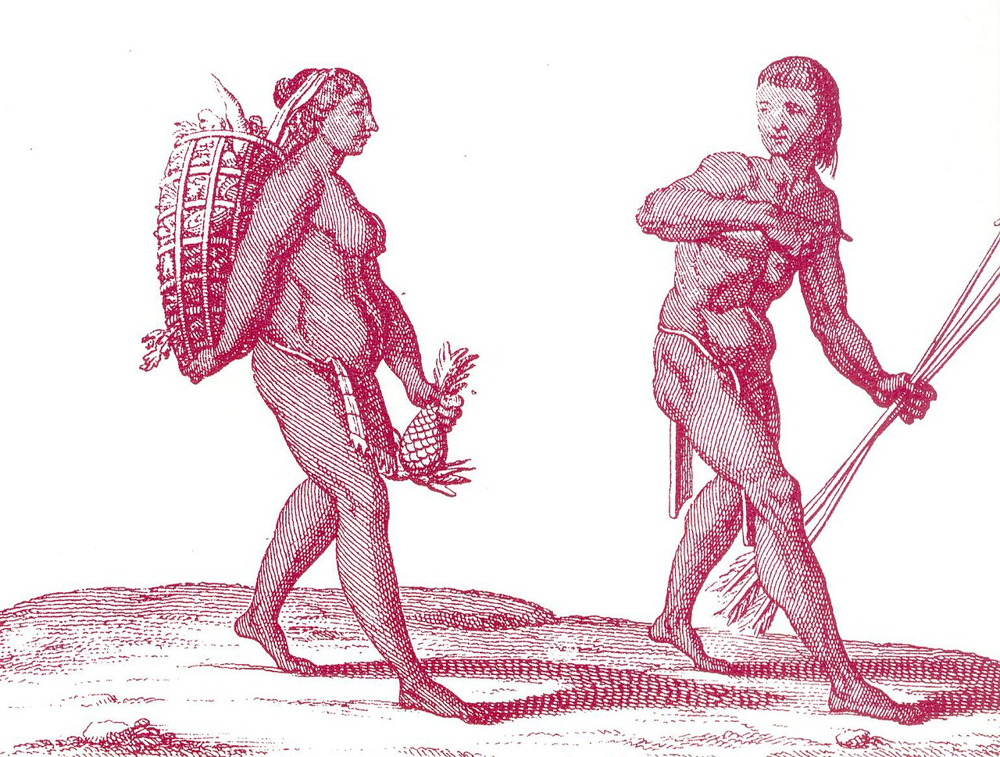
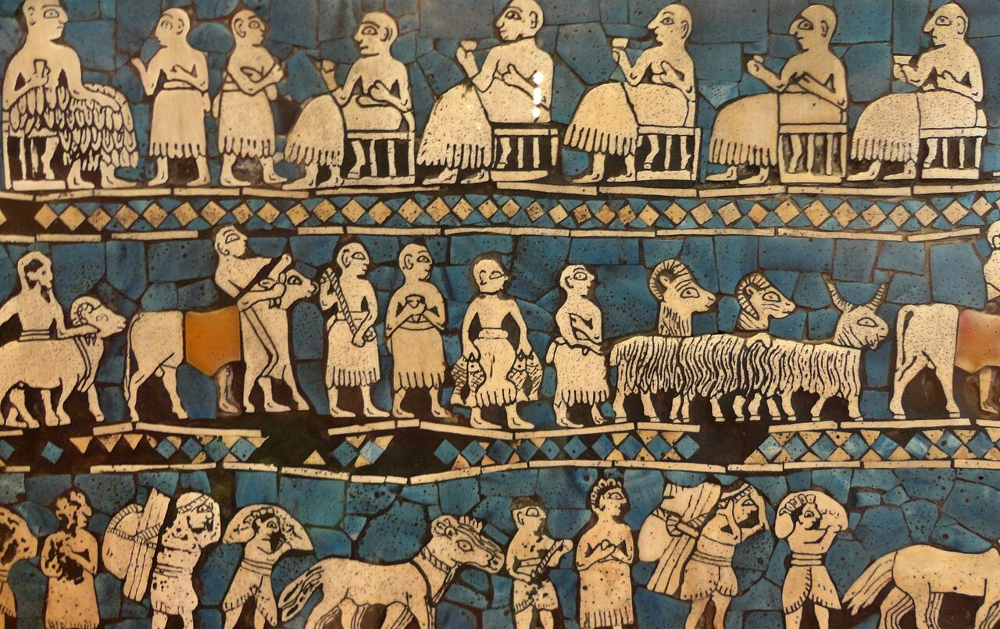
</div>

The shift from hunter-gatherer societies to agriculture and cities created a "data problem"

Human memory alone couldn't solve it (grain storage, taxes, trades, ...)

**Innovation -> Externalized memory using physical devices**

Note:

##### Before this

Humans had to rely on their biological memory or make tally marks on sticks. As villages grew into cities and trade expanded, human memory simply couldn't hold the volume of numbers needed for grain storage, taxes, and trade.

##### Why it was a breakthrough

The abacus "externalized" memory. Instead of holding numbers in your head, you used physical beads to represent them.

##### Key Scientific/Historical Context

The shift from hunter-gatherer societies to agriculture and cities created a "data problem" that human memory alone couldn't solve.


---

<figure>
  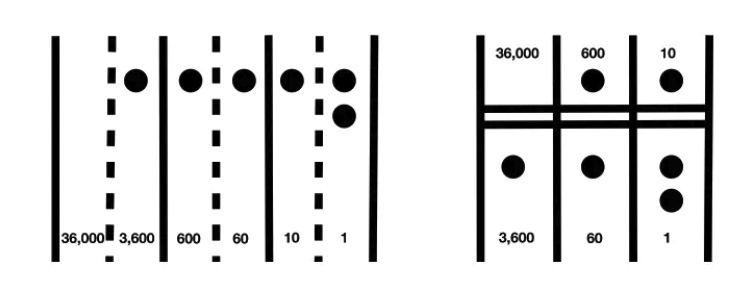
  <figcaption>Mesopotamian Abacus - 2700/3200 B.C.</figcaption>
</figure>

<figure>
  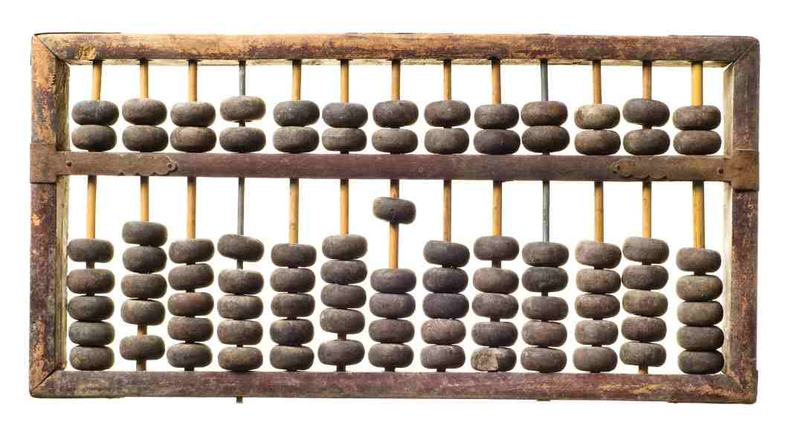
  <figcaption>Chinese abacus, Suanpan - 200 B.C.</figcaption>
</figure>


---

<figure>
  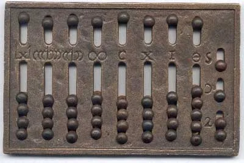
  <figcaption>Roman abacus - 100 A.C.</figcaption>
</figure>

<figure>
  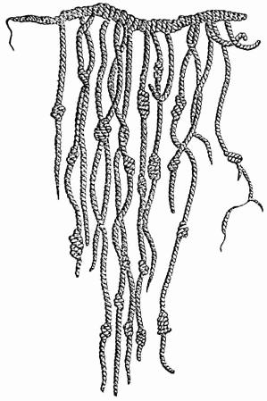
  <figcaption>Inca abacus - 1500 A.C.</figcaption>
</figure>

---

# Communication

If you wanted to share information with the next village, someone had to physically walk, run or ride there

It could take hours or days


---


### Antiquity

# The First Networks

## Figuring out how to "encode" information into physical signals

---

## Smoke Signals & Drum Beats

<div class="container-images">
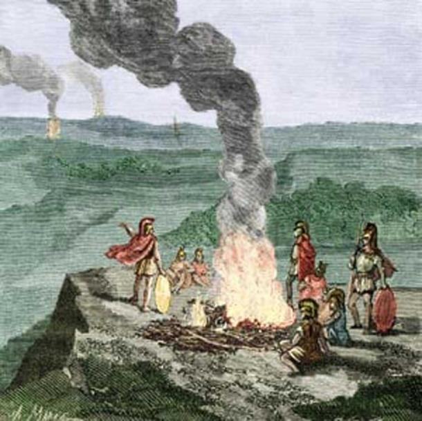
</div>

Innovation → encoded messages into a physical medium

Flaw → Only pre-agreed simple concepts (because of the low bandwidth)

Note:

##### Before this

If you wanted to share information with the next village, someone had to physically walk or run there. It could take hours or days.

##### Why it was a breakthrough

Smoke and drums were the first time humans figured out how to **encode** a message into a physical signal (puffs of smoke vs. no smoke, drum beat vs. silence) to send it instantly over a distance.

##### The Flaw

Extremely low bandwidth. You could only send pre-agreed, simple concepts like "danger" or "come home." You couldn't send a complex poem or a math equation.

---

## Optical Telegraph / Semaphore (1790s - Claude Chappe)

<div class="container-images">
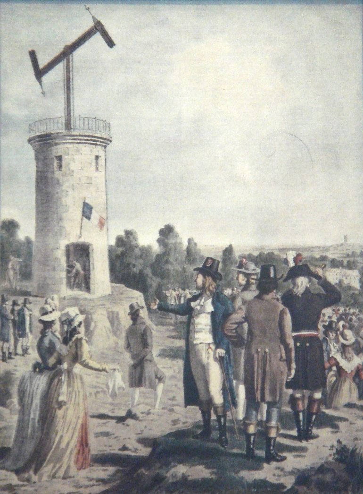
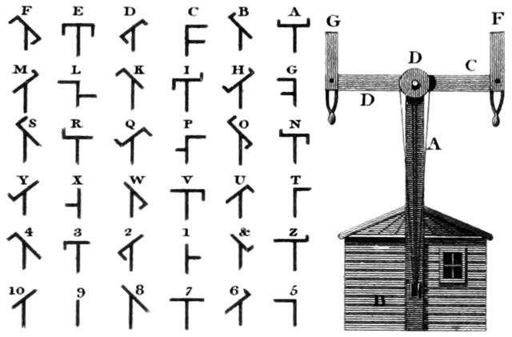
</div>

Innovation → Mechanical relay network with higher bandwidth

Flaw → Required line-of-sight, clear weather and day light to work

Note:

##### Before this

Long-distance communication was limited by the speed of a horse. If a military message had to cross Europe, it took days.

##### Why it was a breakthrough

Chappe invented a system where mechanical arms on a tower could be positioned into different shapes, representing letters or words. It introduced two massive concepts: the **relay network** (passing a message from tower to tower to travel hundreds of miles) and **higher bandwidth** (you could now spell out complex, specific messages in minutes instead of days).

##### The Flaw

It relied entirely on human eyesight and clear weather. If it was foggy or dark, the network completely went down.

---

### (1600s–1800s)

# Mechanical Calculation

## Separation of hardware & instructions

---

<div class="container-images">
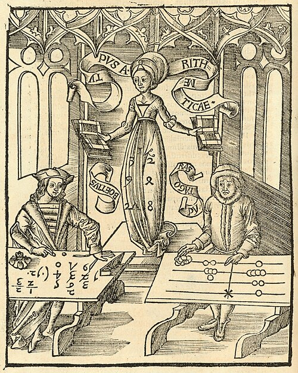
</div>

All math was done by hand on paper or with an abacus.

Humans made constant errors when doing long, tedious calculations like tax rolls or astronomical measurements.

---

## Column method 

<div class="container-images">
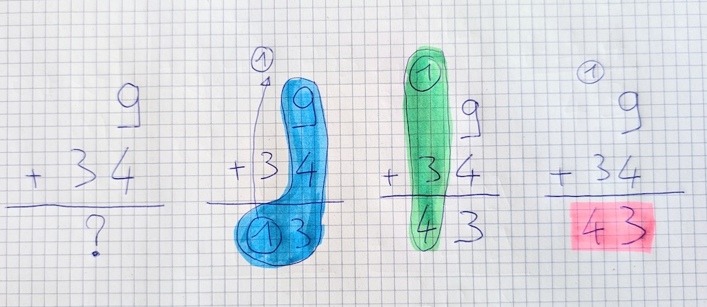
</div>

(carrying digit)

---

## Pascaline (1642) & Leibniz Calculator (1670s)

<div class="container-images">
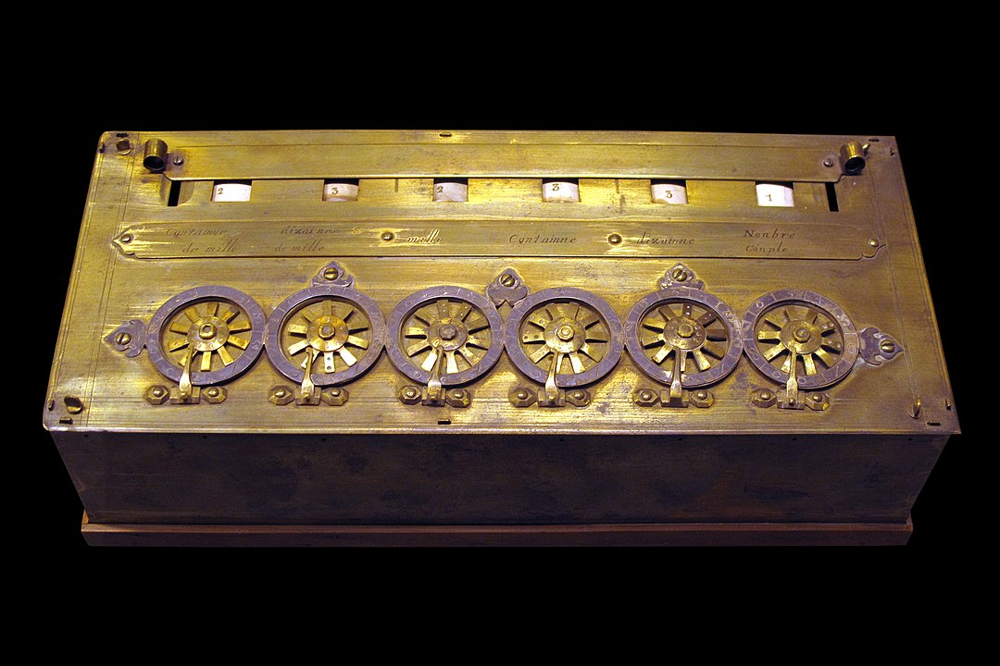
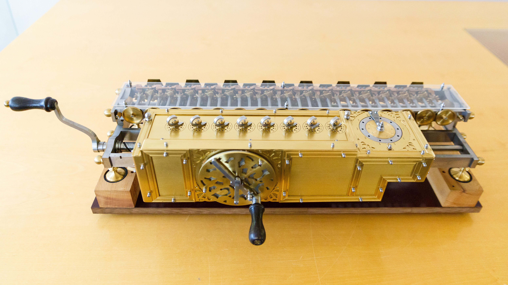
</div>

Automated calculations with physical gears to automatically carry over digits

It automated tedious human math and drastically reduced human error

Note:

##### Before this

All math was done by hand on paper or with an abacus. Humans made constant errors when doing long, tedious calculations like tax rolls or astronomical measurements.

##### Why it was a breakthrough

These machines used physical *gears* to automatically carry over numbers. It automated tedious human math and drastically reduced human error.

---

## Mechanical gears

<div class="container-images">
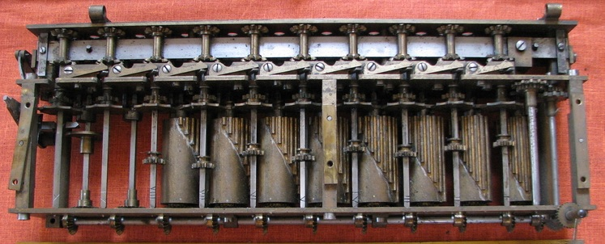
</div>

---

## Jacquard Loom (1804)

# The birth of programmable machines

Jaquard invented a loom that used punched cards to automate weaving.

It wasn't just a textile revolution, it was a computing revolution

---


## Jacquard Loom (1804)

<div class="container-images">
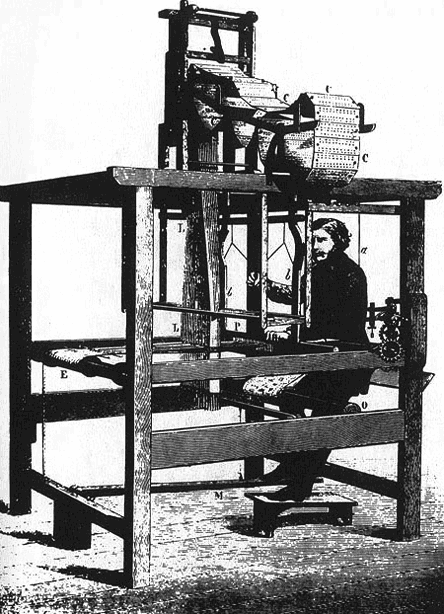
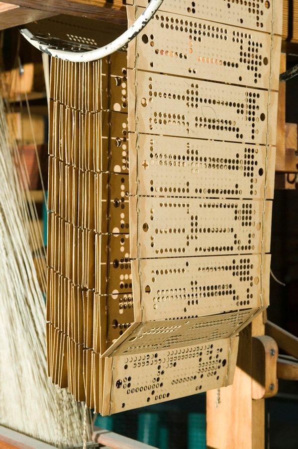
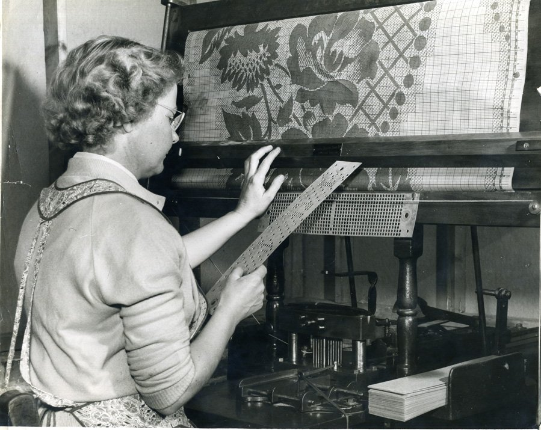
</div>

Looming required tying and untying of threads manually.

**Innovation → Punch cards separated hardware and instructions (external storage)**

Punch cards = Binary logic (holes = 1, no holes = 0)

Note:

##### Before this

To create a complex pattern in fabric, a weaver had to manually tie and untie hundreds of individual threads for every single row. Changing the pattern meant days of manual rethreading.

##### Why it was a breakthrough

Invented **punch cards** to control the loom. The machine (hardware) was separated from the pattern (instructions/software). Change the cards, change the pattern instantly.


---

## Charles Babbage, the Analytical Engine (1830s)

<div class="container-images">
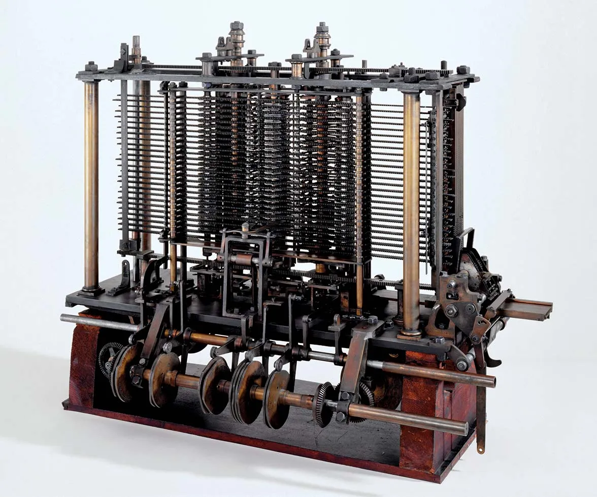
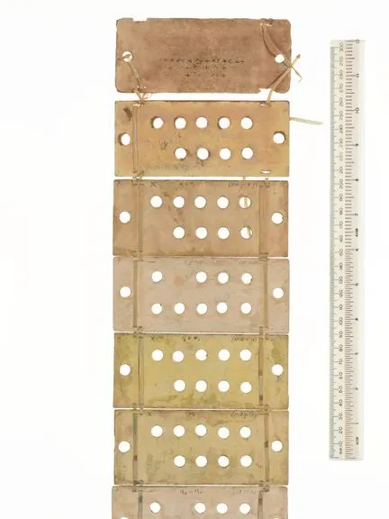
</div>

Babbage used the Jaquard loom idea to do mathematics

His Analytical Engine was the first **mechanical computer** that used:

- Punched cards as input → instructions
- Conditional branching → modern *if* statement
- Memory storage → precoursor to RAM

**Universal machines** that can perform any computation given the right instruction

---

##  Ada Lovelace, the first programmer (1843)

<div class="container-images">

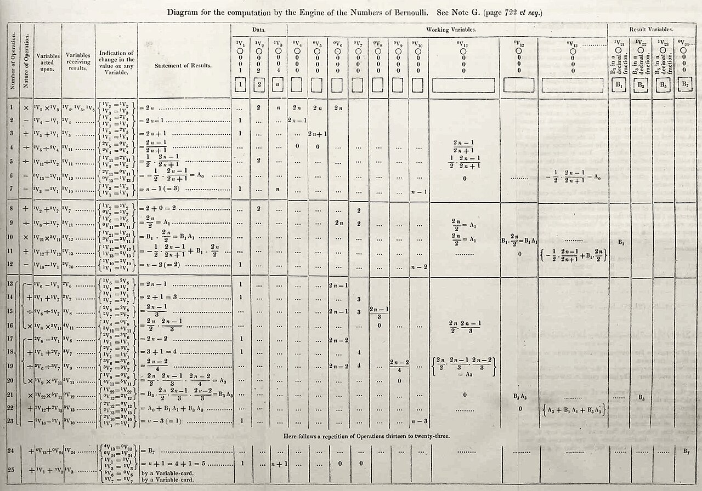
</div>

Lovelace published the first algorithm for the Babbage's Analytical Engine

Visionary recognition that computers could do more than math (music, art, etc.)

Note:

##### Before this

All calculators could only do *one* specific math operation. If you wanted to multiply, you used a multiplying machine; if you wanted to add, you used an adding machine.

##### Why it was a breakthrough

Babbage applied punch cards to a math machine. Lovelace wrote the first algorithm, realizing the machine could manipulate *any* data represented by numbers, not just math. It was the concept of a "universal" machine.

---

### (1700s - 1800s)

# The birth of electrical communication

## The pioneers of electricity and electromagnetism


---

## Electricity (1752 - Benjaming Franklin)

<div class="container-images">
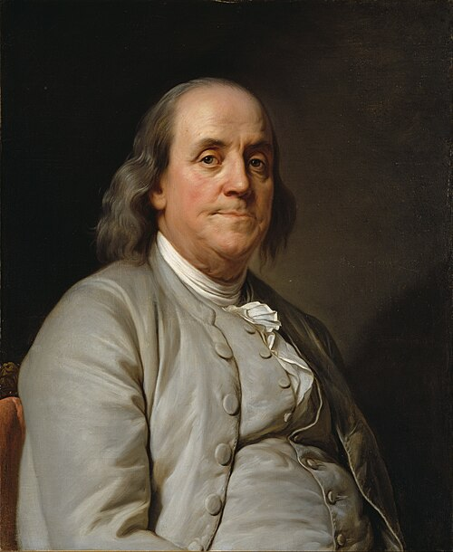

</div>

Proved electricity exists and defined its positive and negative charges

*Electricity: the flow of electric charges*

---

## Battery (1800 - Alessandro Volta)

<div class="container-images">
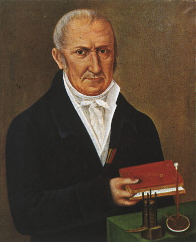

</div>

Invented the first battery (Voltaic Pile)

*Battery: a device that stores chemical energy and provides a steady flow of electric charge*

---

## Electromagnetism (1831 - Michael Faraday)

<div class="container-images">
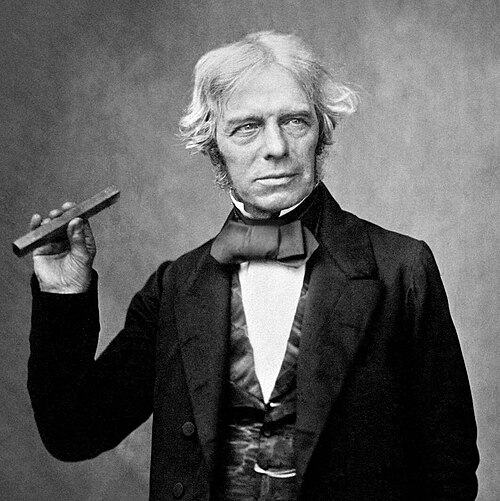

</div>

Discovered that electricity and magnetism are linked (electromagnetic induction)

Pioneered electric motors and generators throught his discovery

Note:

##### Before this

Electricity and magnetism were thought to be two completely unrelated, mysterious phenomena, mostly used for parlor tricks.

##### Why it matters
Discovered that electricity and magnetism are two sides of the same coin. This is the foundational science for every electronic component, from the vacuum tube to the modern microchip.

---

## Relays (1835 - Joseph Henry)

<div class="container-images">
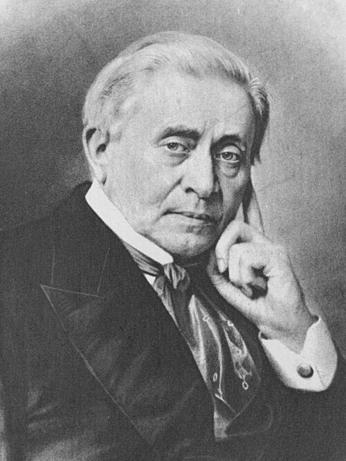

</div>

Improved electromagnets and invented the relay, a key technology for long‑distance telegraph circuits

*Relays: electromagnetic switches that use a small current to control a larger one*

---

###  (1830s–1880s)

# The Telegraph and Telephone

## Sending data through wires

---

## The Electric Telegraph (1837 - Samuel Morse)

<div class="container-images">
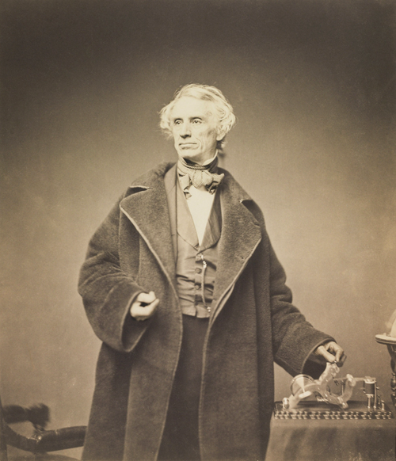
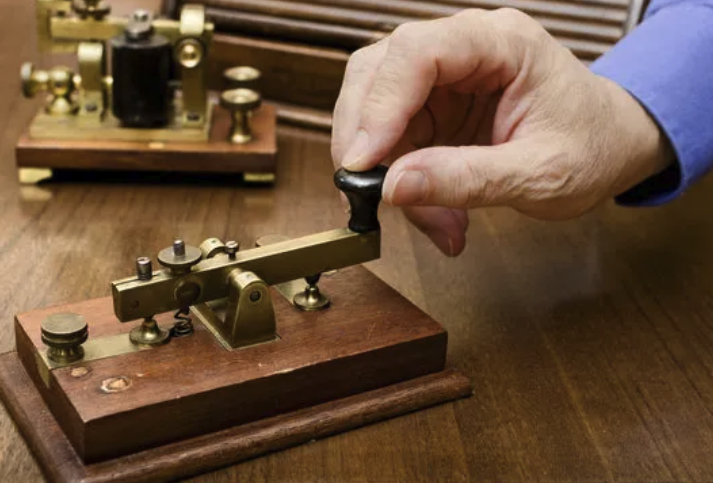
</div>

Digital encoding is used to transmit data (manually decoded by an operator)

Before → Optical Telegraph (1790s - Claude Chappe) failed in bad weather or night

Innovation → Electrical pulses through wires using Morse Code

Flaw → Required trained human operators to translate dot and dashes

Note:

##### Before this

The optical telegraph (Chappe) was the fastest communication, but it completely failed at night, in the rain, or in fog. You also needed a line-of-sight chain of towers, which was incredibly expensive to build and staff.

##### Why it was a breakthrough

Used electromagnetism to send electrical pulses through buried copper wires. It defeated weather and distance. It introduced **Morse Code**, proving human language could be translated into electrical on/off signals—the exact binary concept computers use today.

##### The Flaw

It required trained human operators to manually translate the dots and dashes. It was digital, but manual.

---

## Morse code

<div class="container-images">


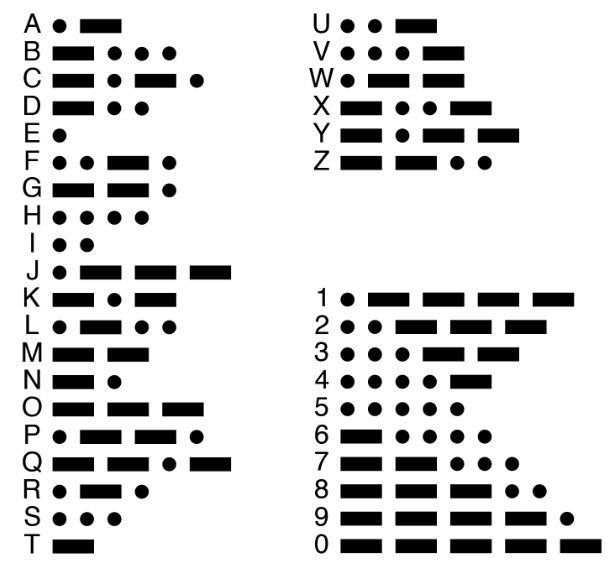
</div>

---

## Telegraph transmission lines

<div class="container-images">

</div>


---

## The Transatlantic Telegraph Cable (1866)

<div class="container-images">
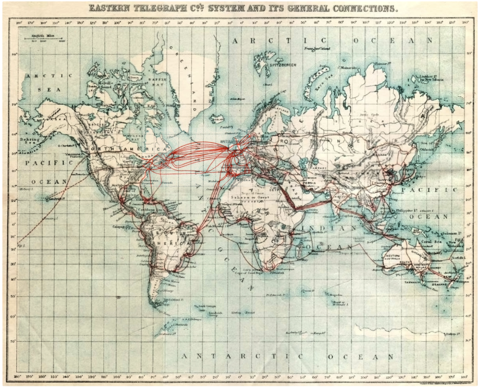
</div>

Before → Communication across oceans took weeks via ship / navigation

Innovation → Physical ocean floor cables linking continents instantly

Note:

##### Before this

Sending a message between Europe and the Americas required putting a letter on a boat. It took weeks, meaning business and governments operated on a massive delay.

##### Why it was a breakthrough

Laying massive cables across the ocean floor physically linked the continents, allowing data to cross the Atlantic in minutes. It was the first time the world was "networked" physically.

---

## The Telephone (1876 - Alexander Graham Bell)

<div class="container-images">
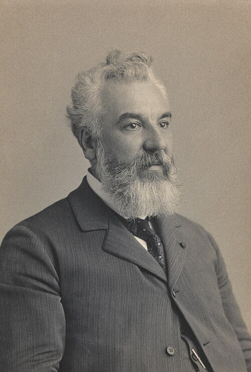

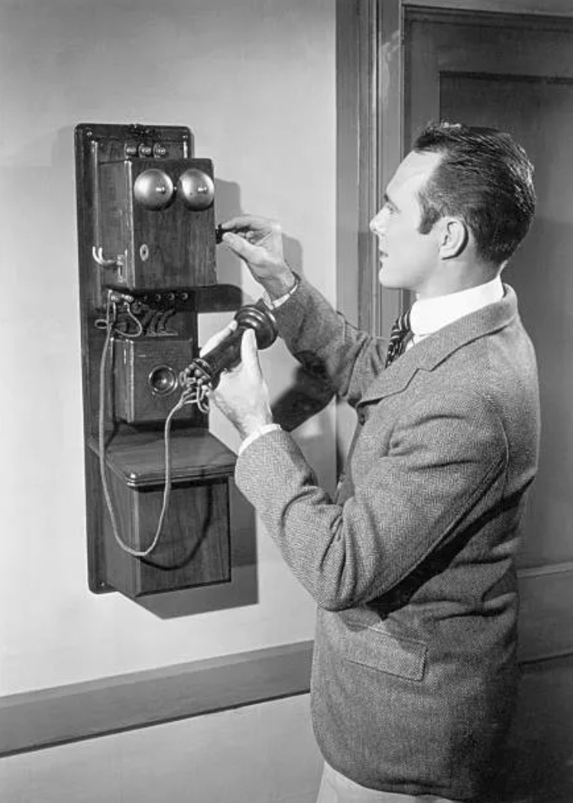
</div>


Before → Telegraph could only send coded signals (binary, dashes and dots, words and numbers)

Innovation → Converted sound waves (voice) into continuous electrical waves

User experice → people could hear human voices and emotions

Note:

##### Before this

The telegraph could only send coded, discrete signals (dots and dashes). You couldn't transmit the nuance of a human voice (tone, emotion, continuous sound).

##### Why it was a breakthrough

Bell figured out how to convert sound waves (analog) into continuous electrical waves and back into sound.

##### Why it matters to computing

It introduced the concept of **analog signals**. For the next 100 years, the global communication network would be built on analog technology, which later had to be adapted to carry digital computer data.

---

###  (1880s - 1910s)

# Electrification, light bulb and vacuum tubes

## AC vs. DC power

---

## Light bulb and DC power (1879 - Thomas Edison)


<div class="container-images">
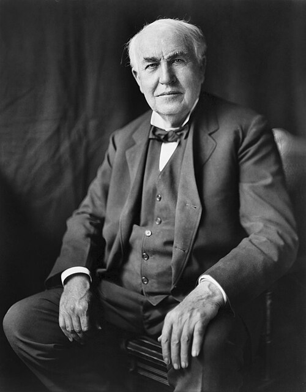


</div>

Improved the incandescent light bulb to make it a usable product (better materials, vacuum)

Created the first **large-scale electric power system** (DC power, power stations, wiring, meters)

Invented the **phonograph** (record audio into a physical support)


---

## AC power transmission (1890 - Nikola Tesla)

<div class="container-images">
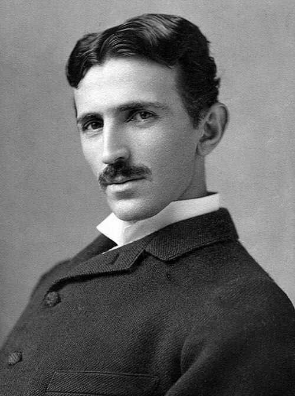
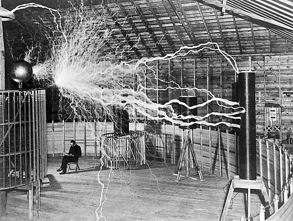
</div>

Pioneer of AC (Alternating Current) electricity and modern power systems and transmission

Developed the AC induction motor

---

## Vacuum tube (1904 - John Ambrose Fleming)

<div class="container-images">
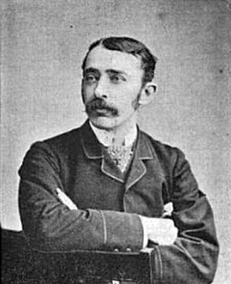
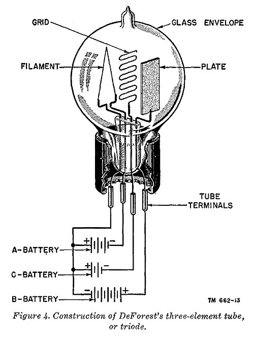
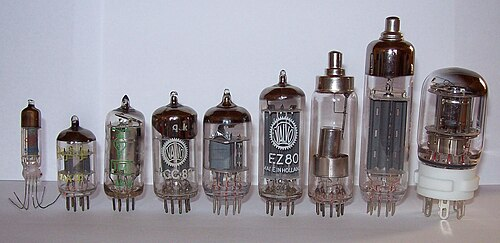
</div>

Electronic switch and amplifier

Faster with not moving parts compared to relays

Hot, big and power hungry

---

### (1890s–1910s)

# The Radio

## Defeating the wires (Wireless communication)

---

## Radio / Wireless Telegraphy (1895 - Guglielmo Marconi)

<div class="container-images">
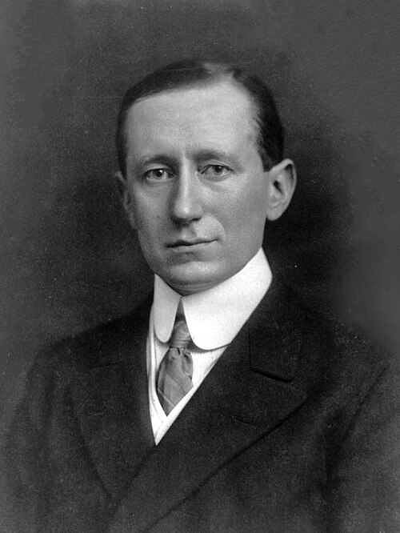

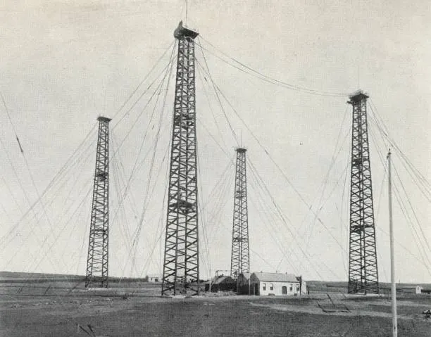
</div>

Uses antennas and electromagnetic waves to send telegraph signals wirelessly over long distances

Without this discovery, Wi-Fi, Bluetooth, and mobile data would not exist

It forced the invention of the **vacuum tube** to amplify weak radio signals


Note:

##### Before this

The telegraph and telephone required a physical copper wire to be strung between Point A and Point B. You could not communicate with a moving ship, and laying wires across mountains or to remote areas was often physically impossible.

##### Why it was a breakthrough

Marconi proved you didn't need wires. By pushing high-frequency alternating current into an antenna, he created electromagnetic **radio waves** that traveled invisibly through the air.

##### Why it matters to computing

This introduced the concept of the **wireless spectrum**. Without this discovery, Wi-Fi, Bluetooth, and mobile data would not exist. It also forced the invention of the **"Vacuum Tube"** to amplify weak radio signals.

---

### (1900–1940s)

# Early Computing Machines

## Computers become electronic and universal

---

## The Theory of Computing (1936 - Alan Turing)

<div class="container-images">
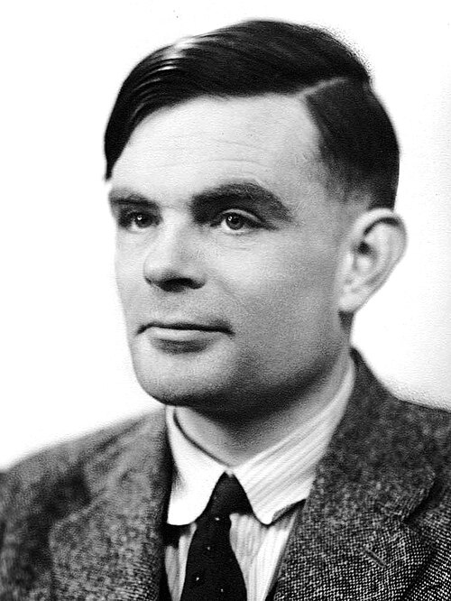
</div>

He described the **universal machine (Turing machine)** as an abstract model of a computer that can be programmed

Its key idea is that **one machine can perform any computable task** if given the right instructions

No need for a different machine for each problem

(central role in breaking the **Enigma code** during WWII)

Note:

##### Before this

If you wanted a machine to solve a new math problem, you had to build a completely new physical machine for that specific problem.

##### Why it was a breakthrough

Turing proved that a single, simple machine (the "Turing Machine") could solve *any* solvable problem, just by changing its instructions. We didn't need a different machine for every problem—we just needed one "Universal" machine and code.

---

## Z3 - Konrad Zuse (1941)

<div class="container-images">
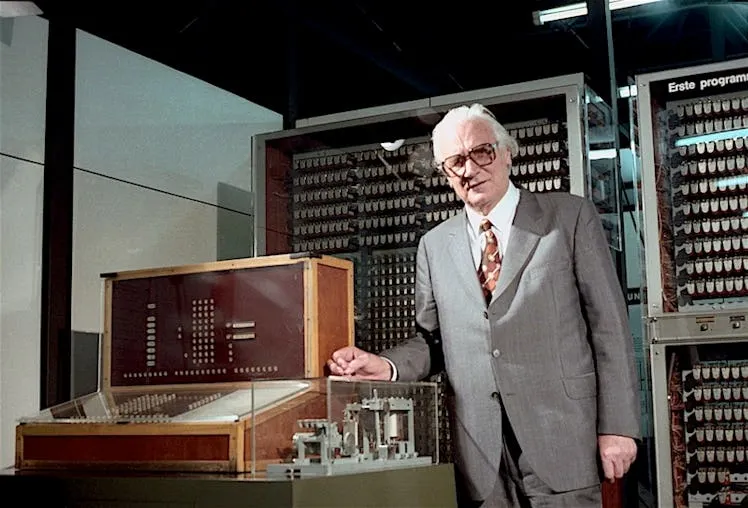
</div>

First functional, program-controlled, fully automatic digital computer

It was binary and used floating-point numbers (with comma), key features of modern architectures

It was based on relays

---

<div class="container-images">
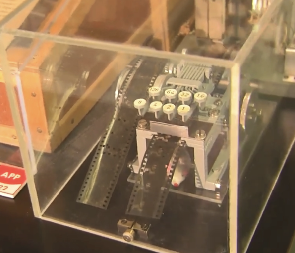

</div>

The code was punched (written) on 35mm film because cheap and easily available

It used about 2000 relays with a clock frequency of 5-10 Hz (about **2-4 FLOPS**)

---

## ENIAC (1945)

<div class="container-images">

</div>

Build by the U.S. Army to originally compute artillery firing range tables and shell trajectories (differential equations)

It has been use also for advanced calculation on the Manhattan Project (nuclear energy and weapons)

Very fast for at the time beacuse it used **vacuum tubes** and was huge


Note:

##### Before this

Calculators were mechanical. Gears took time to turn, limiting how fast massive calculations (like artillery firing tables for WWII) could be done.

##### Why it was a breakthrough

The first general-purpose electronic computer. It used **Vacuum Tubes**—glass bulbs that controlled the flow of electricity, acting as lightning-fast electronic switches. It replaced mechanical gears, doing math in seconds instead of weeks.

### The Breakthrough & The Flaw

Vacuum tubes were a massive leap over gears, but they were huge, consumed massive power, and burned out constantly. To program ENIAC, you had to physically rewire it with thick cables for days just to change the calculation.

---

<div class="container-images">

</div>

It had 18'000 vacuum tubes and 1'500 relays

It weighted 27'000kg, 2 meters tall and 30 meters long

It consumed about 150kW of power (equivalent to about 9 typical houses, 17kW)

It had a clock frequency of 5'000Hz, able to do 385 multiplication or 5'000 additions per second

(about **500 FLOPS**)

---

## Instructions loading

<div class="container-images">
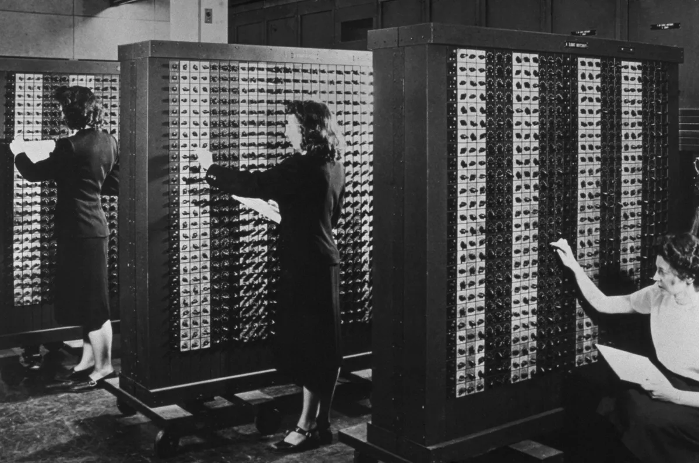
</div>

Instructions and data were loaded manually setting up panels of switches

---

### (1947)

# The Breakthrough of the Century

## From fragile glass bulbs to solid rock

---

## The Transistor (1947 - Bell Labs)

<div class="container-images">
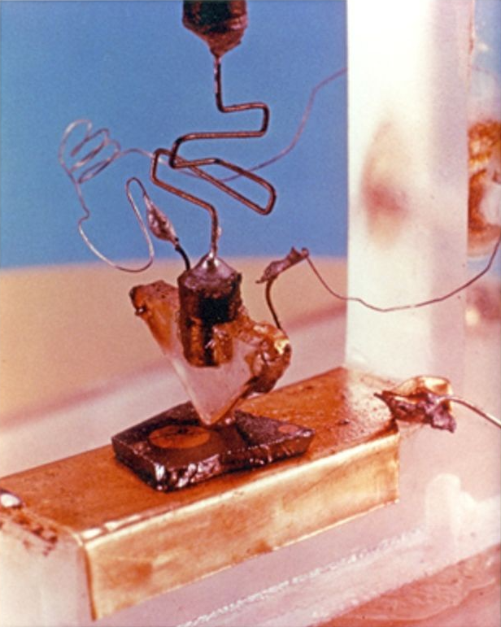
</div>

Solid silicon switches that replaced the vacuum tubes (fragile and burned out)

Transistors were tiny, cheap, consumed almost no power and never burned out

Note:

##### Before this

Computers like ENIAC used vacuum tubes, which were fragile glass bulbs that generated massive heat, consumed entire rooms, and burned out like lightbulbs. You couldn't build anything bigger or more complex because the machine would melt or break down.

##### Why it was a breakthrough

The transistor replaced the vacuum tube. Instead of a fragile glass bulb, a transistor is a tiny piece of solid silicon (a semiconductor) that uses a small electrical current to turn another current on or off.

##### Why this changed everything

Transistors were tiny, cheap, consumed almost no power, and never burned out. Without the transistor, the modern computer, the internet, and the smartphone would be physically impossible.

---

<div class="container-images">
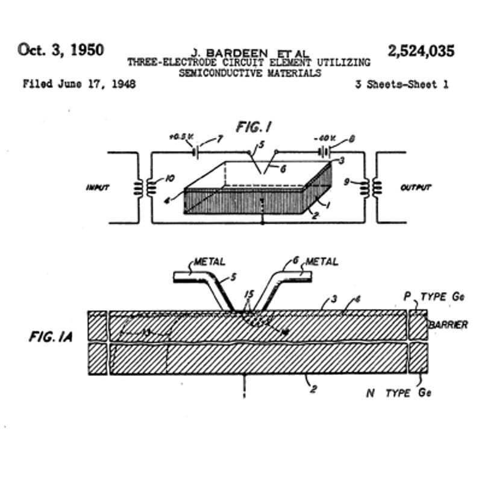
</div>

Instead of a fragile glass bulb (vaccum tubes) a transistor is a tiny piece of solid silicon (a semiconductor)

It uses a small electrical current to turn another current on or off

---

<div class="container-images">

</div>

They come in different shapes and sizes with different properties for different applications

---

### (1940s–1950s)

# The Birth of Programming

## Coding becomes human-readable

---

## Manual instructions loading

<div class="container-images">

</div>

To enter instructions in early computers, knobs and switches had to be accordingly set

```
| Address | Binary          |
|---------|-----------------|
| 0200    | 111001000000    |
| 0201    | 001010010000    |
| 0202    | 1000100001000   |
| 0203    | 111100000010    |
| 0210    | 110000010001    |
```

---

## Low-level language

### Assembler (1940s-1950s)

```javascript
        CLA CLL     // Clear AC and Link flag
        TAD CHAR    // Load 'A' into AC
        JMS TYPE    // Call TYPE subroutine
        HALT        // Stop execution

TYPE:   TSF         // Test TTY status
        JMP .-1     // Wait if busy
        TLS         // Transmit character
        JMP I TYPE  // Return to caller

CHAR:   101         // ASCII 'A' (octal)
```

### Binary

```
| Address | Binary          | Instruction                         |
|---------|-----------------|-------------------------------------|
| 0200    | 111001000000    | CLA CLL (Clear AC and Link)         |
| 0201    | 001010010000    | TAD CHAR (Add CHAR to AC)           |
| 0202    | 1000100001000   | JMS TYPE (Jump to subroutine)       |
| 0203    | 111100000010    | HALT (Stop)                         |
| 0210    | 110000010001    | TSF (Test TTY status)               |
| 0211    | 1010100001000   | JMP TYPE-1 (Wait loop)              |
| 0212    | 110000010010    | TLS (Transmit character)            |
| 0213    | 1011100001000   | JMP I TYPE (Return from subroutine) |
| 0220    | 0000001000001   | CHAR (ASCII 'A')                    |
```

Assembler is directly executed by the machine, **no compiling** required

Assembler introduces an **Instruction Set** to be human-readeable (HALT, JMP, CLA, ...)

---

## The Compiler (1952 - Grace Hopper)

<div class="container-images">
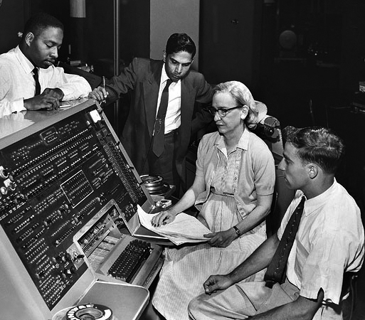
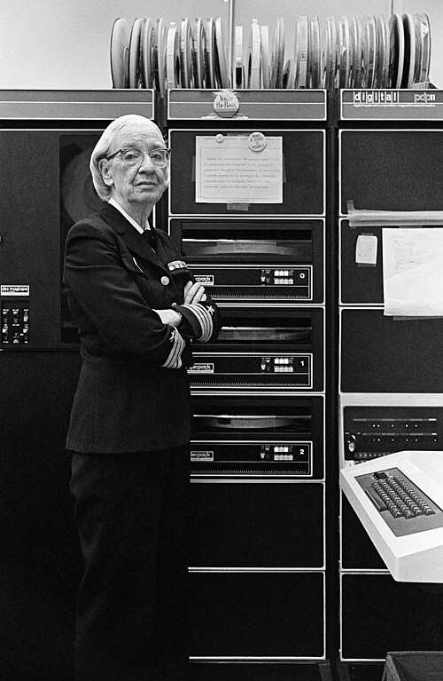
</div>

Programmers had to write instructions in absolute machine code (alphanumeric or binary strings)

Only specific machine's hardware could understand those instructions

Hopper realized that if a computer could do math, it could translate English words into machine code automatically

Note:

##### Before this

Programmers had to write instructions in absolute machine code—long strings of `1`s and `0`s` or cryptic hexadecimal numbers that only the specific machine's hardware understood.

##### Why it was a breakthrough

Hopper realized that if a computer could do math, it could translate English words into machine code automatically.

---

## One code for many machines

<div class="container-images">
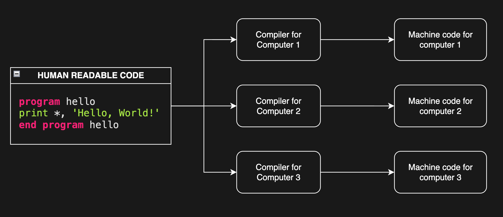
</div>


---

<div class="container-images">
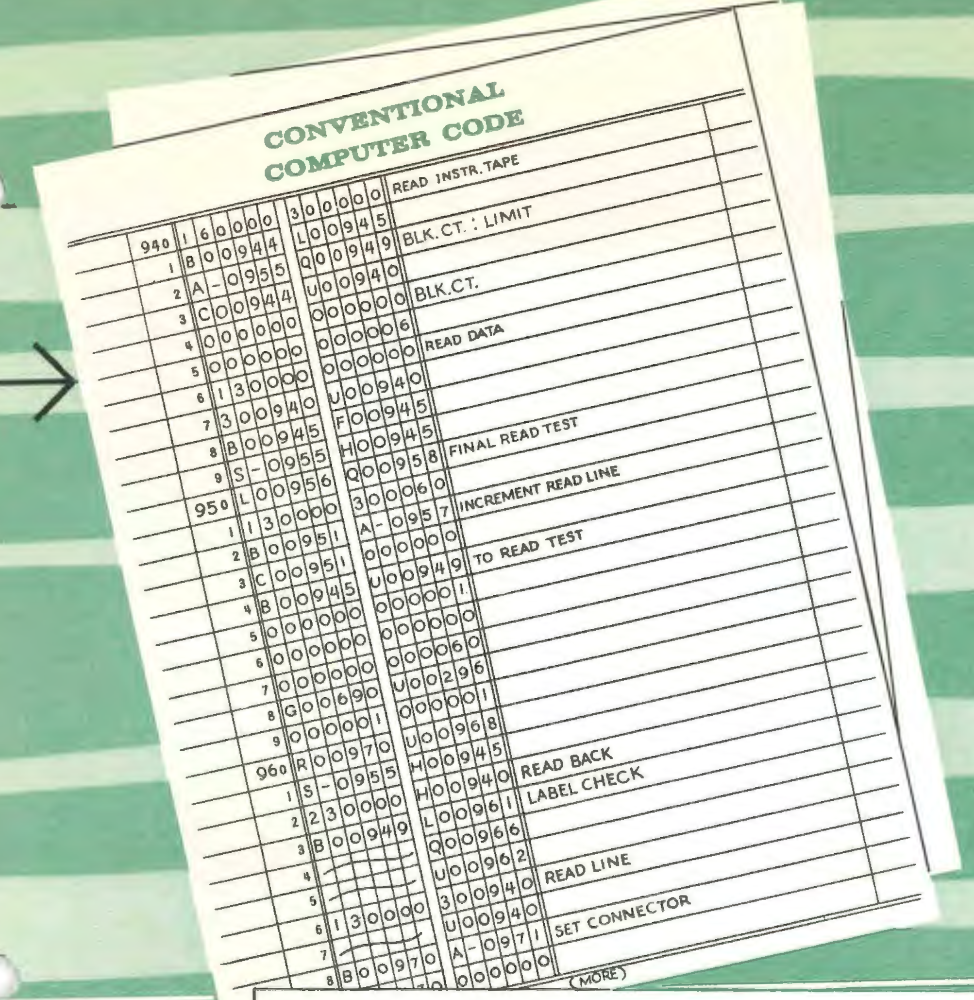
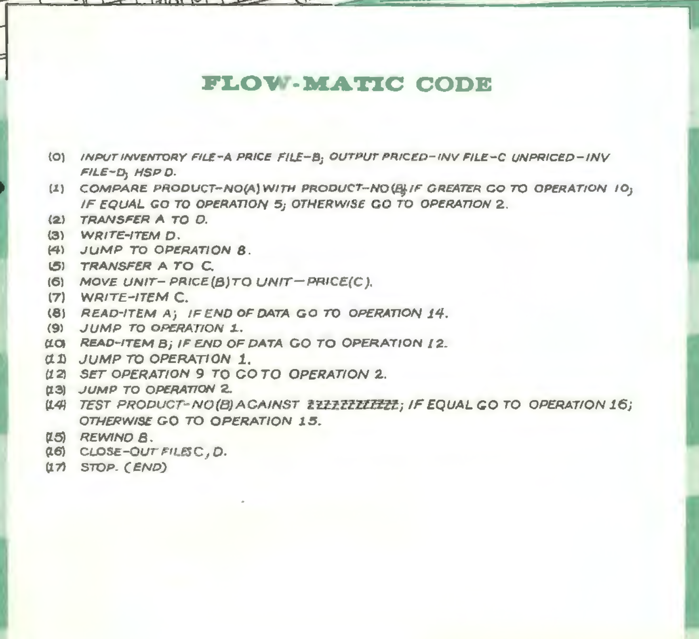
</div>

A program was specified as a sequence of subroutines and its arguments

The subroutines were identified by a numeric code

A-2 system (second version of Hopper compiler), was provided to customer that were invited to send back their improvements

It can be considered an example of the early philosophy of **free and open-source software** (FOSS)

---


## High-level languages (compiled)

### FORTRAN (FORmula TRANslator) 1957

```fortran
program hello
  print *, 'Hello, World!'
end program hello
```
### COBOL (COmmon Business-Oriented Language) 1959

```cobol
IDENTIFICATION DIVISION.
PROGRAM-ID. HELLO-WORLD.

ENVIRONMENT DIVISION.

DATA DIVISION.

PROCEDURE DIVISION.
000-MAIN-PROCEDURE.
    DISPLAY "HELLO WORLD!".
    STOP RUN.

```

Programmers could **write human** readeable code instead of machine code.

Coding time dropped from months to hours

Machine-independent languages that could be compiled into different machine codes for different computers

Note:

##### Before this

Writing a program took months of meticulously writing binary codes by hand, and it was full of human errors.

##### Why it was a breakthrough

Programmers could now write `PRINT "HELLO"` instead of `10101010`. Coding time dropped from months to hours. It separated the *coder* from the *machine mechanics*.

---

## Compiled code for UNIVAC I

HELLO, WORLD!

```
0000: U01000
1000: B02010
1006: Y03000
1012: 900000
0210: 00300
0300: HELLO,
0301:  WORLD!
0302: §

```

With explantion:

```
// Instructions
0000: U01000  // unconditional transfer to 1000 (start)
1000: B02010  // load A from address 210 (pointer to text)
1006: Y03000  // print from address 300 through 359 (HSP)
1012: 900000  // STOP UNIVAC (halt)

// Data
0210: 00300   // word containing address 300 (start of text)
0300: HELLO,  // "HELLO,"   (alphanumeric chars in UNIVAC I code)
0301:  WORLD! // " WORLD!"  (continuation of the string)
0302: §       // end-of-text marker (implementation-dependent)

```

---

## COBOL (curiosities)

<div class="container-images">
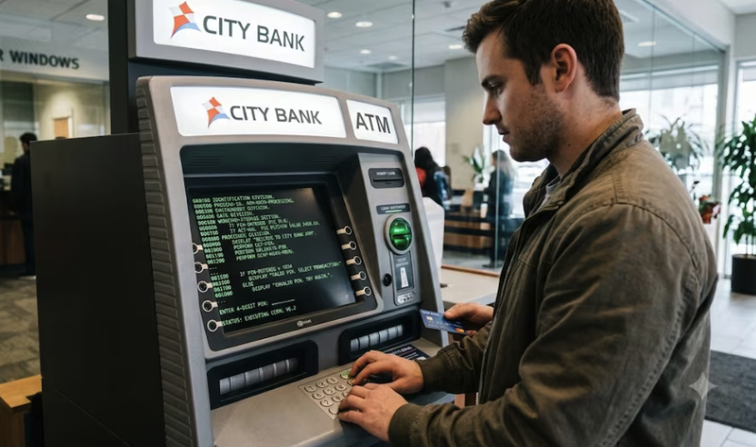
</div>

About **40% of the current core global banking system** are build on COBOL (220-800+ billions of lines of code)

COBOL systems handle about **3 Trillion of dollars in transaction per day!**

About **95% of ATM transactions** still run on COBOL code

Banks and governments are actively seeking for new COBOL developers to maintain the systems beacuse the original workforce is retireing. They do pay well.

---

### (1960s–1970s)

# The Software and Chip Era

## Software ecosystems begin and computers shrink

---

## Before and after

<div class="container-images">

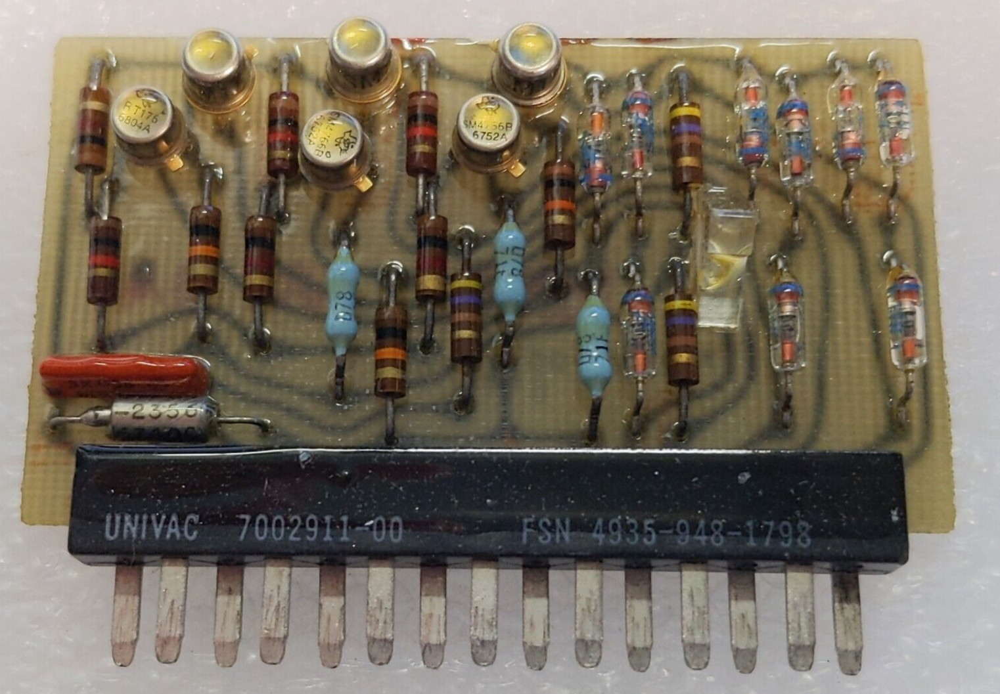
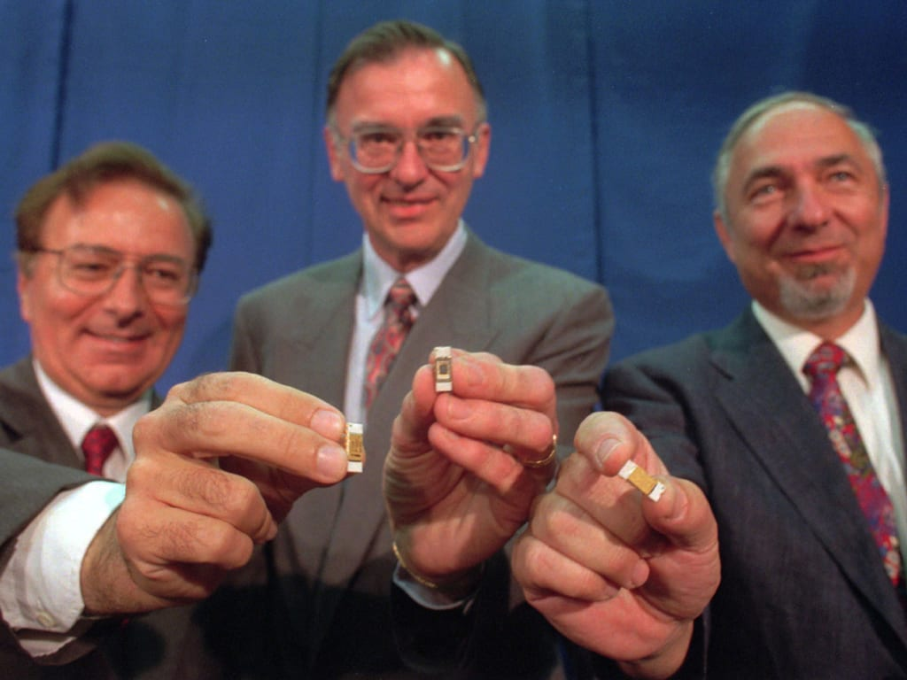
</div>


From components connected with wires, to Printed Circuit Boards (PCB) and to Integrated Circuits (IC)

---

## Intel 4004 Integtated Circuit / Microchip (1971)


<div class="container-images">
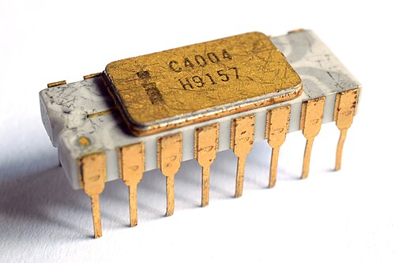
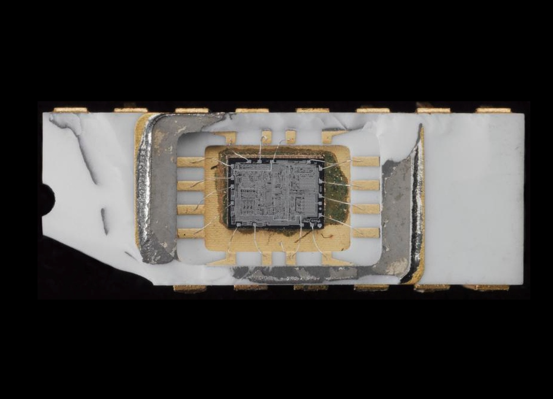
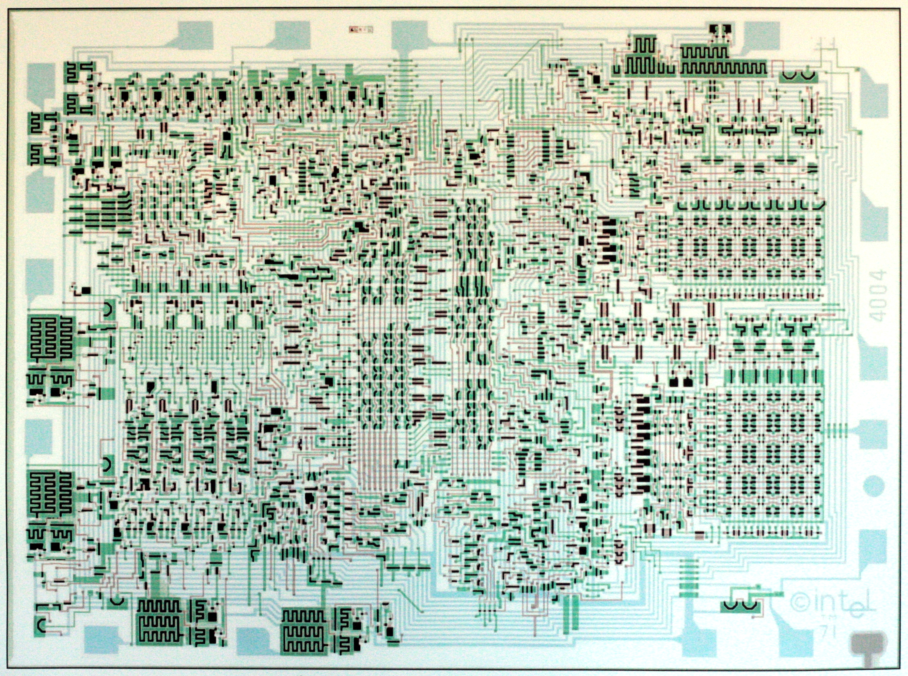
</div>

The Intel 4004 was the first of the Intel Central Processing Units (CPU)

Printing thousands of transistors on one chip (silicon), avoiding wireing thousands of individual transistors by hand

The computer "brains" become microscopic, cheap and reliable

Note:

##### Before this

Engineers had to wire thousands of individual transistors together by hand on massive circuit boards. The wires were so complex that "bugs" (literal insects, or physical shorts) were common, and there was a physical limit to how small you could make the connections.

##### Why it was a breakthrough

Scientists figured out how to print thousands of transistors onto a single tiny silicon chip at once (Intel 4004 in 1971). This made computer "brains" microscopic, cheap, and reliable.

---


## Intel 4004 vs. ENIAC

<table border="1">
  <thead>
    <tr>
      <th>Specification</th>
      <th>ENIAC</th>
      <th>Intel 4004</th>
    </tr>
  </thead>
  <tbody>
    <tr>
      <td>Clock frequency</td>
      <td>5'000 Hz</td>
      <td>750'000 Hz</td>
    </tr>
    <tr>
      <td>Number of transistors / components</td>
      <td>18'000 tubes (not transistors)</td>
      <td>2'300 transistors</td>
    </tr>
    <tr>
      <td>Operations per second (approx.)</td>
      <td>500 operations per second</td>
      <td>100'000 operations per second</td>
    </tr>
    <tr>
      <td>Power consumption</td>
      <td>150'000 W</td>
      <td>< 1 W</td>
    </tr>
    <tr>
      <td>Physical size</td>
      <td>30 &times; 2 m</td>
      <td>3 &times; 4 mm</td>
    </tr>
    <tr>
      <td>Weight</td>
      <td>27 tons (27'000'000g)</td>
      <td>1.3 g</td>
    </tr>
  </tbody>
</table>

---

## UNIX Operating System and C language (1969 - Bell Labs)

<div class="container-images">
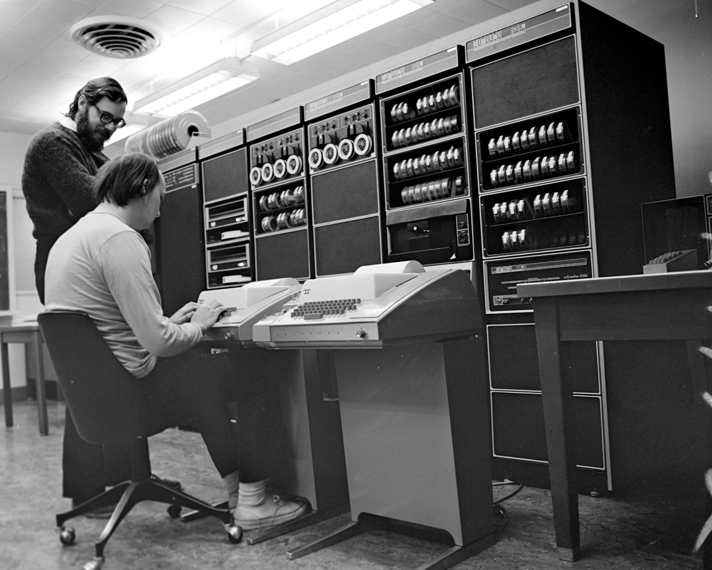
</div>

Developed by Ritchie and Ken Thompson (they developed C to build UNIX)

As computers got faster, they needed an "Operating System (OS)" to manage the hardware

UNIX added multi-user, multitasking, portability, hierarchical file system, permissions and system call interface (shell)

Linux and MacOS are based on UNIX


Note:

##### Before this

Software was written for one specific machine. If you upgraded your hardware, you had to rewrite the entire program from scratch.

##### Why it was a breakthrough

As computers got faster, they needed an "Operating System" to manage the hardware. UNIX did this. The C language was invented to write UNIX. C was fast but portable—you could run it on *different* types of machines. Write once, run anywhere.

---

## Instructions directly controlling the hardware

<div class="container-images">
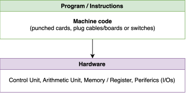
</div>

ENIAC and Z3 — program or instructions directly controlling the hardware, without a conventional operating system

---

## Modern UNIX-like operating system (OS)

<div class="container-images">
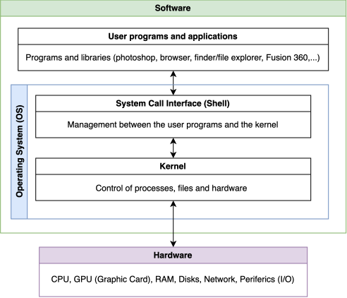
</div>

Applications running above the operating system, which manages the hardware, display, I/O, and network

---

## The Operating System (OS) interface

<div class="container-images">
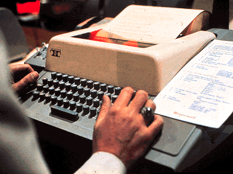
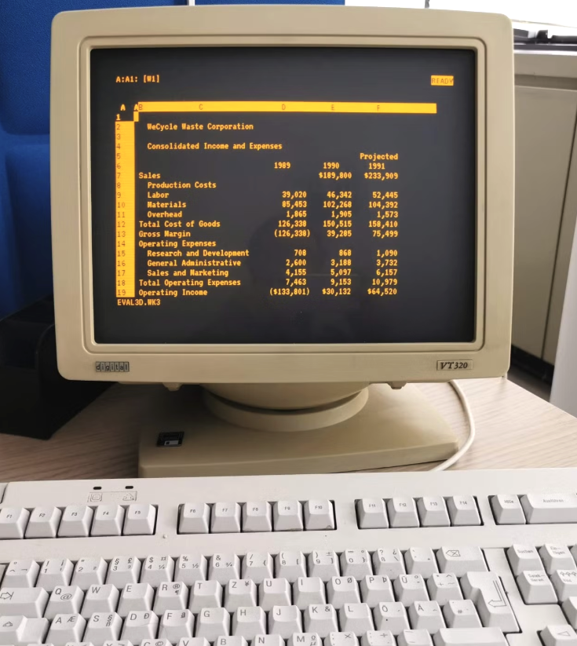
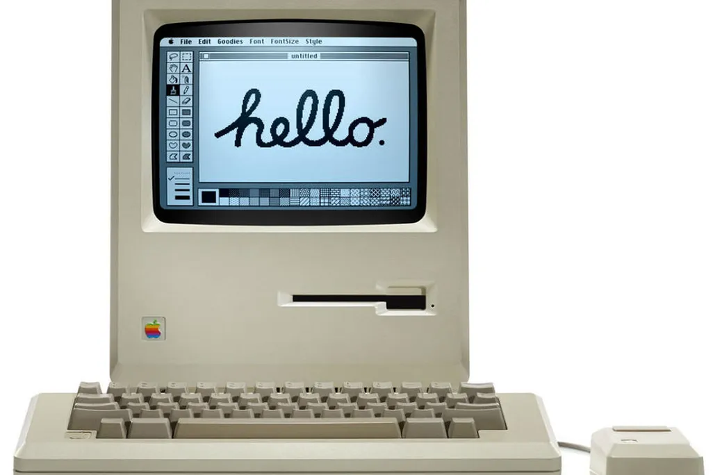
</div>

From teletypes that printed on paper, to screen terminals and the current Graphical User Interface (GUI)

---

## C Language (1972)

```
#include <stdio.h>

int main() {
    printf("Hello, World!\n");
    return 0;
}
```

The **C language** was invented to write the UNIX Operating System

Write once, run anywhere. (it could be run on different machines thanks to the OS "layer").

Most of the common software are build largely on C or C++ (successor):

Linux, Windows and macOS componets, Chrome, Safari, Python, JavaScript, MySQL, Git, Adobe Suite, Unity and Unreal Engine, and countless games, mobile apps and embedded systems
---

## C language innovation

<table>
  <thead>
    <tr>
      <th>Feature</th>
      <th>Why it was revolutionary</th>
    </tr>
  </thead>
  <tbody>
    <tr>
      <td>High-level structure</td>
      <td>Functions, loops, variables, and readable syntax.</td>
    </tr>
    <tr>
      <td>Low-level control</td>
      <td>Direct memory access, pointers, and bit manipulation.</td>
    </tr>
    <tr>
      <td>Portability</td>
      <td>UNIX could be moved to different computers with relatively little new machine code.</td>
    </tr>
    <tr>
      <td>Efficiency</td>
      <td>C programs ran nearly as fast as assembly.</td>
    </tr>
    <tr>
      <td>Small compiler</td>
      <td>It worked well on limited hardware.</td>
    </tr>
  </tbody>
</table>

---

### (1970s–1980s)

# Personal Computers

## Computers move from labs to homes

---

## The first all-in-one home computers (1970s)

<div class="container-images">
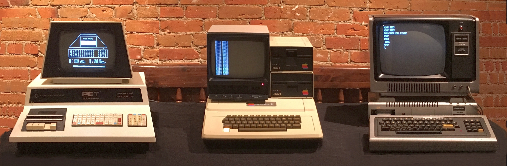
</div>

Commodore PET (1977) -  Apple II (1979) - Radio Shack TRS-80 Model I (1977)

Before computers were locked in universities and corporate labs: to use one, you had to book it and punch cards

Everyday people, schools and small business could now use computers for games, writing and finances

They could be programmed with BASIC (programming language), easy to learn


Note:

##### Before this

Computers were massive mainframes locked in university labs or corporate basements. To use one, you had to book time and punch cards. They were viewed strictly as industrial math machines.

##### Why it was a breakthrough

Apple and IBM realized everyday people could use them for games, writing, and finances. Computers moved from labs to homes.

---

## The Graphical User Interface / GUI (Xerox PARC - 1970s)

<div class="container-images">
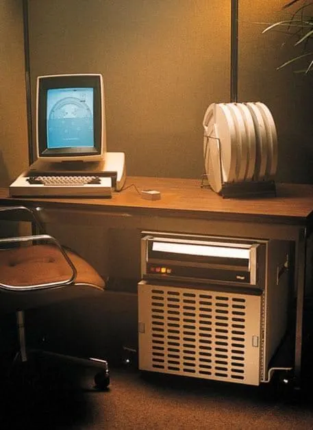
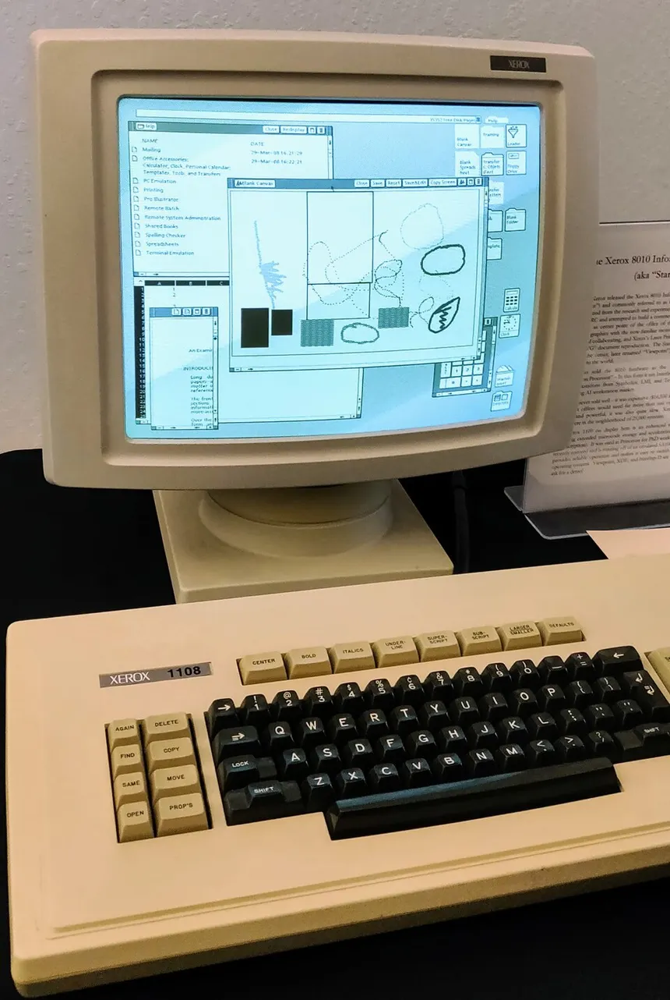
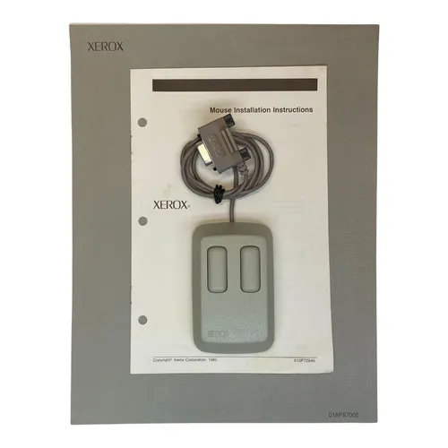
</div>

Xerox introduced overlapping windows, clickable icons, menus, and the computer mouse for navigation.

The GUI replaced text-based command lines with a visual desktop metaphor (WYSIWYG - What You See Is What You Get)

Steve Jobs and Apple engineers visited PARC in 1979, where they were demonstrated these technologies in exchange for stock options

Due to high-costs, Xerox was commercially unsuccessful, allowing Apple and then Microsoft to dominate the market

---

## First successful GUI pc (1984 - Apple Macintosh)

<div class="container-images">

</div>

The first commercially successful mass-market GUI computer with the mouse was the Apple Machintosh in 1984 (based on the Xerox innovations)

Before everything was typed with the keyboard into a command line interface

A big innovation was the **mouse** (single button) with **point-and-click** as standard


Note:

##### Before this

Using a computer meant typing text commands on a blank screen (`C:\ copy file.txt`). You had to memorize a thick manual of commands just to find a file.

##### Why it was a breakthrough

The Macintosh brought the mouse and clickable icons. You didn't need a manual anymore; you just pointed at a picture of a folder and dragged it.

---

## The break trough

<div class="container-images">
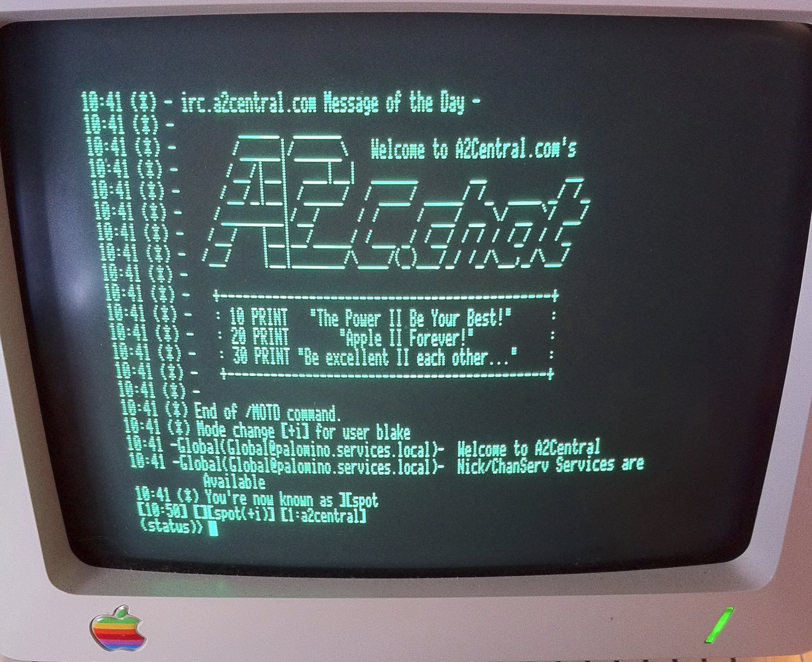
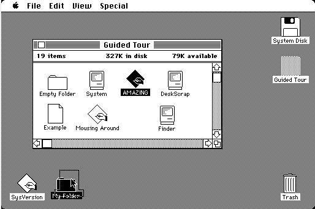
</div>

The GUI avoided having to memorize commands

It introduced the **drag-and-drop, double-click, pull-down menus**

This made computer intuitive for non-technical users

---

## GUI innovations

<div class="container-images">
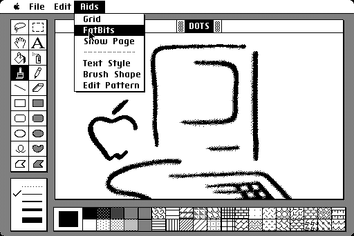
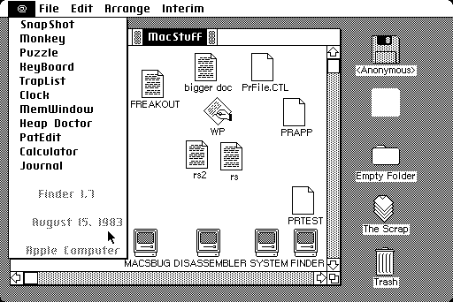
</div>

It inspired the entire industry (Microsoft, Adobe, etc.)

It proved that computers could be **creative tools**, not just calculators (Ada Lovelace, 1800s)

---

### (1960s–1990s)

# The Network Revolution

## Computers become connected

---

## The Telephone network

<div class="container-images">
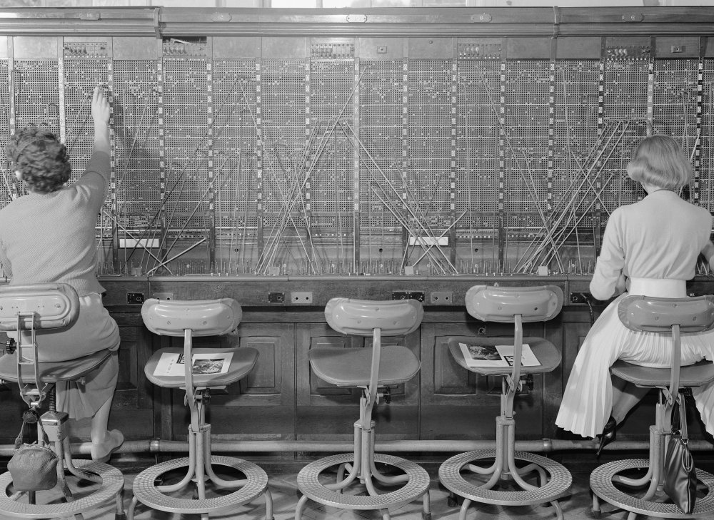

</div>

Telephone networks used "circuit switching".

A dedicated wire had to stay open for the **entire duration of a call**.

**If cut, the connection died**.

---

## The Scientific Foundation - Packet Switching (1960s)

<div class="container-images">
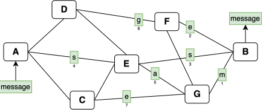
</div>

To survive a nuclear war (Cold War), the US military needed a network without a central "brain."

**Packet switching broke data into small chunks** that could travel different routes and reassemble at the destination

This became ARPANET (1969), the seed of the **internet**.

---

## ARPANET (1969-1990), network innovations

<div class="container-images">
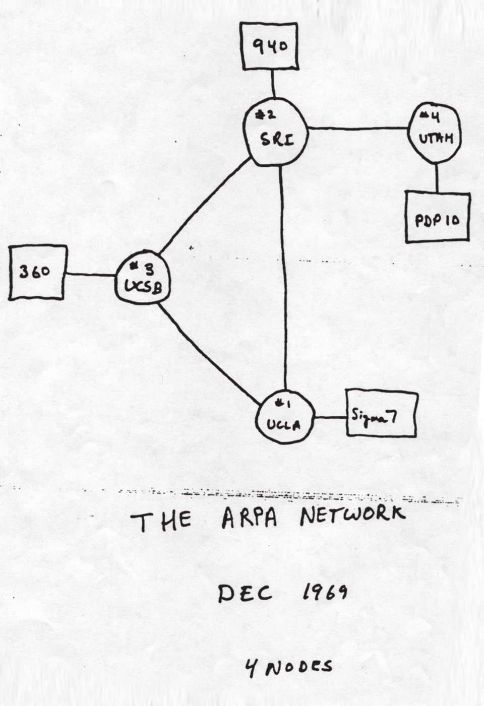
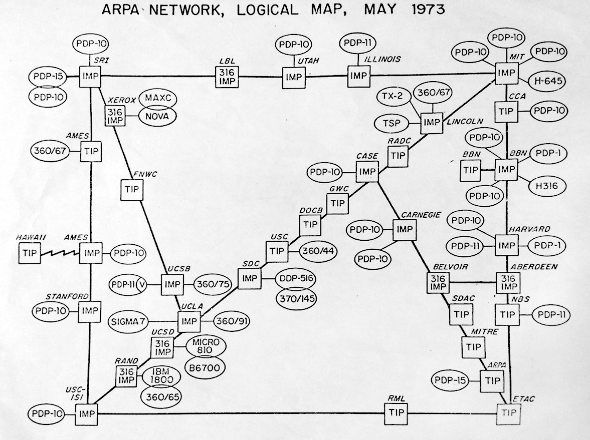

</div>

**Network of networks**: Different computers and networks could communicate with one another.

**IMP routers**: Interface Message Processors connected host computers and managed data routing.

**Early online services**: ARPANET enabled *remote login, file transfer, and email*

**TCP/IP adoption**: Its adoption in 1983 provided the foundation for today’s Internet

---

## The World Wide Web (1991 - Tim Berners-Lee)

<div class="container-images">
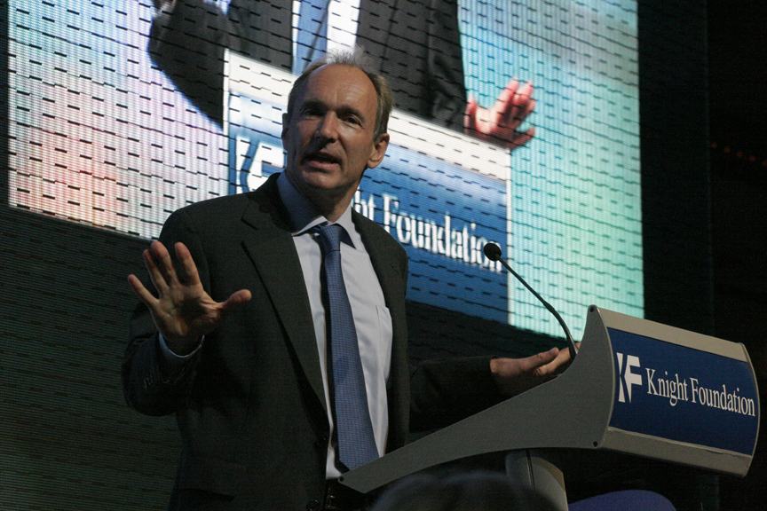
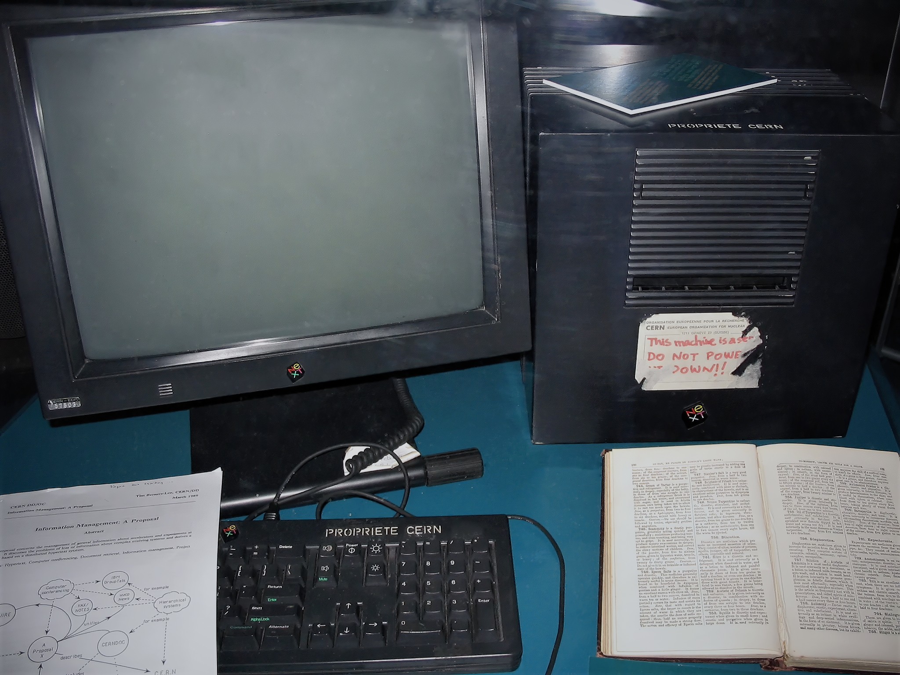
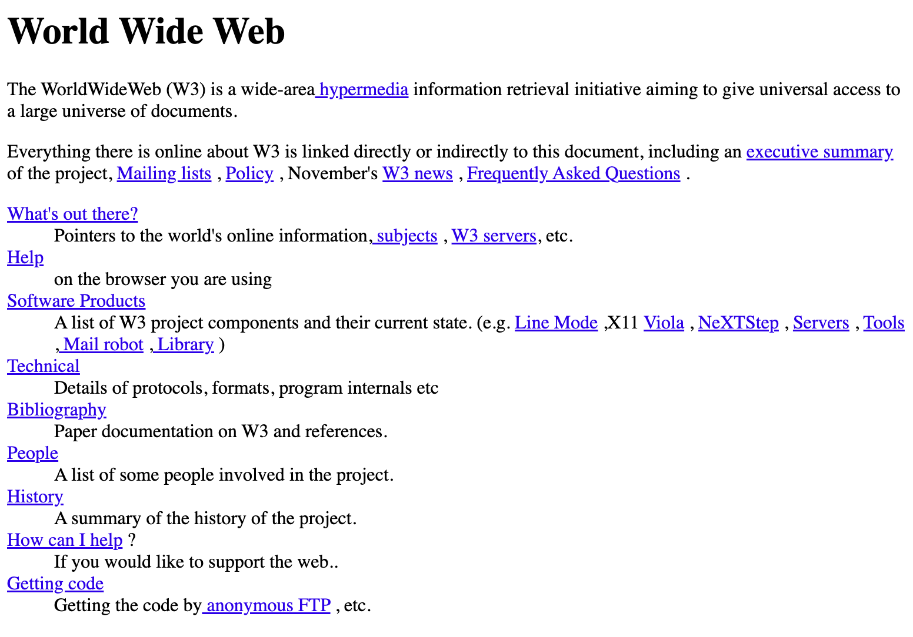
</div>


The early internet (ARPANET) was just raw terminal text. You had to know exact computer addresses and type commands to navigate ugly, nested folders. It was purely for scientists.

Berners-Lee invented **HTML** (to structure documents), **HTTP** (to transfer them), and **URLs** (to find them).

He gave the internet a user-friendly interface: the **"page"** with clickable **"links"**

https://info.cern.ch/hypertext/WWW/TheProject.html

---

## CSS Cascading Style Sheets (Håkon Wium Lie, 1994)

<div class="container-images">

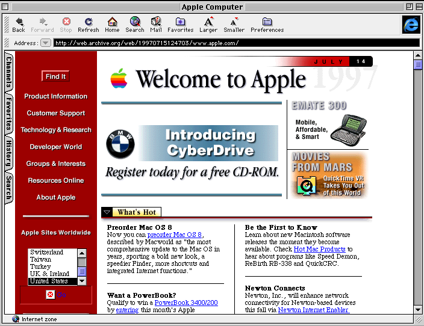
</div>

CSS separates content from presentation, it controls how HTML looks (colors, fonts, spacing, layout, animations)

Its **“cascading”** system decides which rule wins when multiple rules apply

Different browsers renders CSS a little differently

---

## JavaScript (Brendan Eich, 1995)

<div class="container-images">

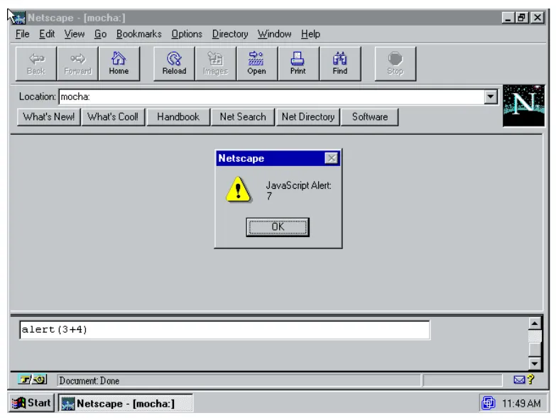
</div>

HTML web pages were completely **static**. You could read a page, but you couldn't click a button to make something happen without the page reloading entirely.

JavaScript was invented to make web pages **react** to the user (clicks, pop-ups, animations).

**Interaction design on the web was born.**

---

### (2000s–2010s)

# Modern Programming & Telecom

## Coding becomes accessible + The Cloud + Wireless freedom

---

## Open Source (GNU Project, Richard Stallman 1983)

<div class="container-images">


</div>

Software code was heavily guarded as proprietary company secrets.

If you wanted to build a new app, you had to write the foundational code from scratch.

The Open Source movement, allowred developers to share code globally for free.

You could build a startup using free, community-built tools

---

## Open Source libraries, OS and codebases

<div class="container-images">

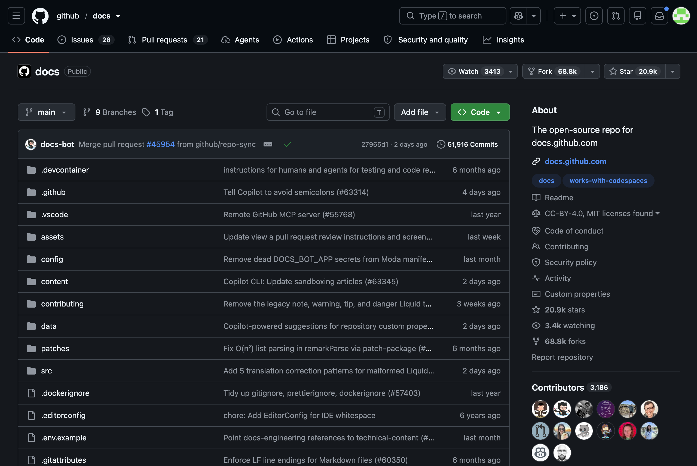
</div>

**Around 90-97% of modern commercial software contains open-source components**

**Linux** is the most-used open-source operating-system technology worldwide (Android 70% of mobile OS, 100%  of the top 500 supercomputers, server/cloud)

WordPress, PHP, NGINX/Apache, JavaScript, Python, Node.js, PostgreSQL, Git are among the most used open-source software today

---

## Cloud Computing & APIs (2000s)

<div class="container-images">


</div>

To run your business, you had to physically buy servers, rent a cooled warehouse, and hire IT staff to maintain them.

Cloud Computing allowed to **"rent"** processing power, for example from Amazon (AWS)

**APIs (Application Programming Interface)** allowed apps to **"talk"** to each other seamlessly.

---

## Mobile Networks (3G/4G/5G - 2000s to 2020s)

<div class="container-images">
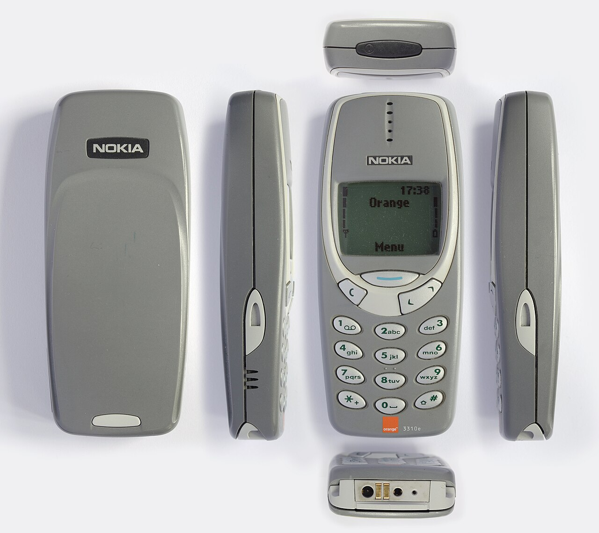

</div>

Early cell phones (1G/2G) were built for voice calls and tiny text messages.

Data was painfully slow, making internet access on a phone almost useless.

By turning voice and data into high-speed digital packets, mobile networks finally allowed real **internet access without physical wires**

This untethered the computer from the desk, enabling the **app economy** and **constant connectivity**.

---

### (2007 - present)

# The Smartphone

## The computer fits in your pocket

---

## The Smartphone (2007 - iPhone)

<div class="container-images">
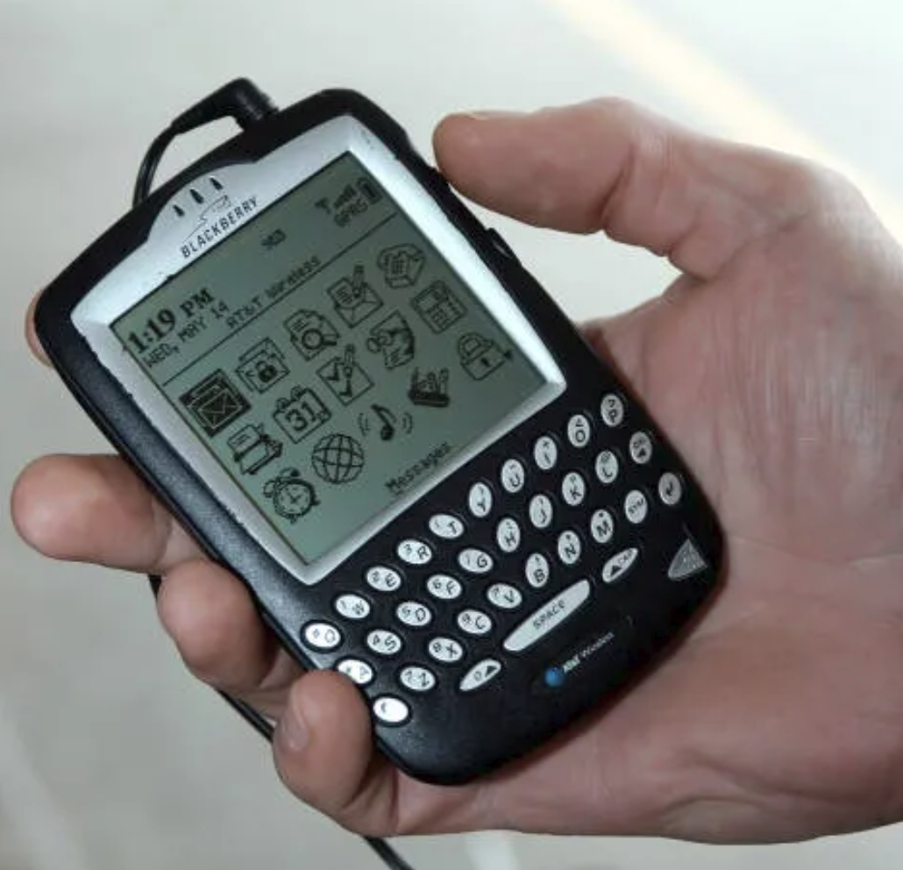
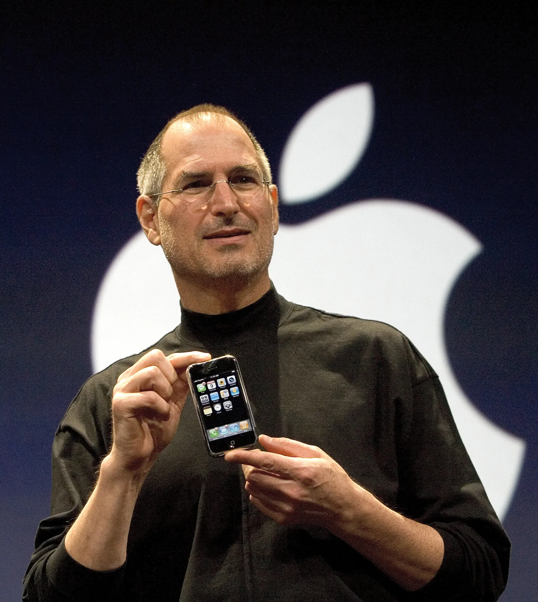
</div>

"Smart" phones (like Blackberries) had tiny screens, physical keyboards, and clunky menus designed for business emails.

They were miniaturized computers, but still felt like tools for IT departments.

The **iPhone** put a full microprocessor, high-speed internet connection, and advanced sensors (camera, GPS, gyroscope) behind a large, touch-responsive screen

It forced designers to invent **Responsive Design**—websites and apps that adapt to the size of the screen and the **user's physical context**.

---

### (1990s–2010s)

# The Web Era

## The internet evolves from read-only to interactive, then to decentralized

---

## Web 1.0 (1990s - The Static Web)

<div class="container-images">
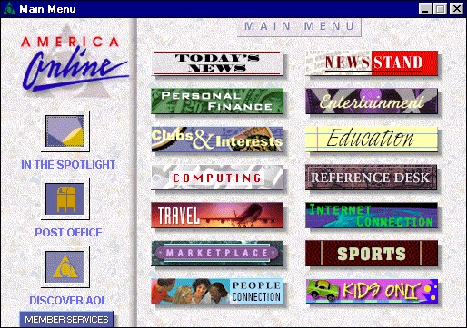
</div>

The internet existed mostly as closed, **proprietary networks** (like AOL or CompuServe) where users were limited to navigating closed "walled gardens" of content created by the providers.

Web 1.0 was the era of the **"read-only" web**. It consisted of static HTML pages connected by hyperlinks. Anyone could publish a document to a global audience instantly.

It was largely passive. Average users could only consume information; **creating content required knowing HTML and having server access**, so most sites were just digital brochures.

---

## Web 2.0 (2000s - The Social Web)

<div class="container-images">

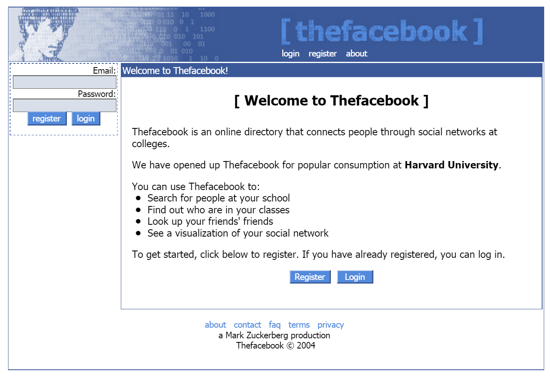
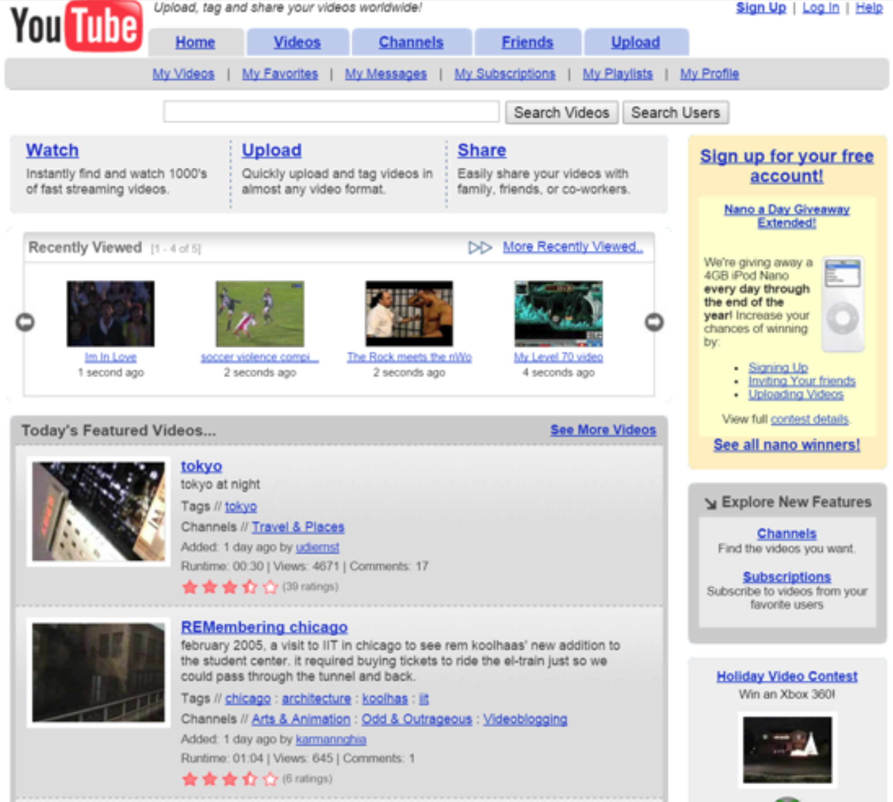
</div>

The web was a vast library of **static, disconnected pages**, there was no easy way to interact or collaborate.

Web 2.0 turned the "read-only" web into the **"read-write" or "participatory" web**.

Platforms like Wikipedia, YouTube, and Facebook allowed anyone to upload content, comment, and collaborate **without knowing how to code**.

AJAX and JavaScript allowed pages to update dynamically.

It became highly centralized. A few massive tech giants monopolized user data, attention, and algorithms.

---

## Web 3.0 (2010s–Present - The Decentralized/Semantic Web)

<div class="container-images">

</div>

Web 2.0 centralized user data under Big Tech, limiting digital ownership of data, identies and assets.

Platforms can change rules  or ban users at will.

Web 3.0 uses blockchain, tokens, and decentralized apps (DeFi, dApps) to return control to users.

It remains experimental, complex, difficult to scale, and environmentally controversial.

---

### (2020 – today)

# Artificial Intelligence

## Computers are now collaborators

---

## Generative AI & LLMs (ChatGPT, etc.)

<div class="container-images">

</div>

For 70 years, humans had to learn the computer's language (code).

If you didn't know how to write HTML or Python, you could not build software.

Now, computers have learned human language.

You can describe a website in plain English, and the AI writes the code.

---

## Low-code / No-code tools

Designers had to hand off their visual designs to engineers to make them functional, creating a bottleneck between the idea and the working product.

Now with AI tools the barrier to creating technology has never been lower.

The focus is shifting from **how to write code** to **how to design good solutions**.

---

# Storing instructions and data

## The evolution of data storage technologies

---

## How data in computer is defined (bit)

<div class="container-images">

</div>

Generally speaking, the smallest information that exists is **binary**, meaning only **2 states**

This binary information is called in the computer world a **bit** that can have a value of **1** or **0**

---

## 8 bits = 1 Byte

<div class="container-images">
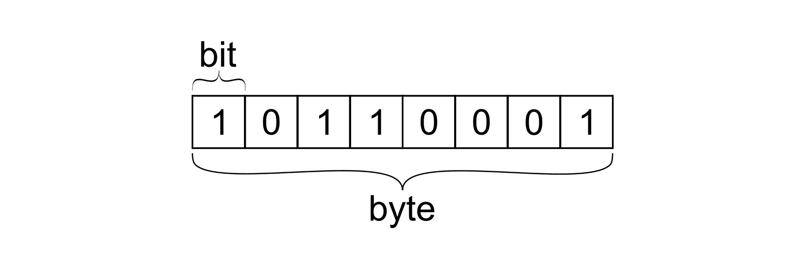
</div>

The size of data is usually expressed in **Bytes**

1 Byte represents **256 different states** (2^8)

---

## Byte, kByte, MByte, etc.

| Unit | Abbreviation | Bytes |
|---|---:|---:|
| Byte | B | 1 |
| Kilobyte | kB | 1'000 |
| Megabyte | MB | 1'000'000 |
| Gigabyte | GB | 1'000'000'000 |
| Terabyte | TB | 1'000'000'000'000 |
| Petabyte | PB | 1'000'000'000'000'000 |
| Exabyte | EB | 1'000'000'000'000'000'000 |

---

## Punch cards (1940s-1970s)

<div class="container-images">


</div>

Every card contained one instruction (line of code) or data

Cards were **read** by the computer to **load** the program and data

Storage capacity of about **80 bytes** (1 byte = 1 character)

*"This sentence is deliberately written to use all eighty available characters."*

---

## Punch cards (1940s-1970s)

<div class="container-images">


</div>

To **store** an average Spotify song (3.5 minutes, 8.4MB):

it would have taken about **105'000 punch cards**, about **500kg** of paper!

To load them into a computer, it would taken about **2h and 11 minutes**!

---

## Paper tape (1940s-1970s)

<div class="container-images">
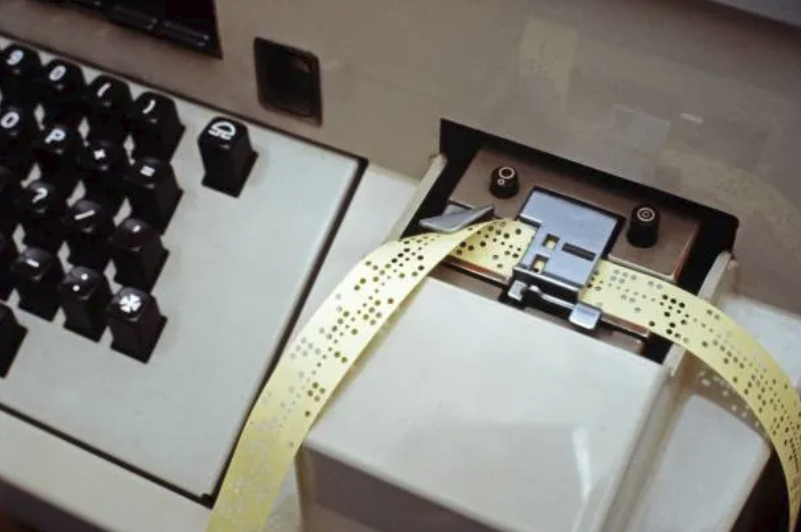
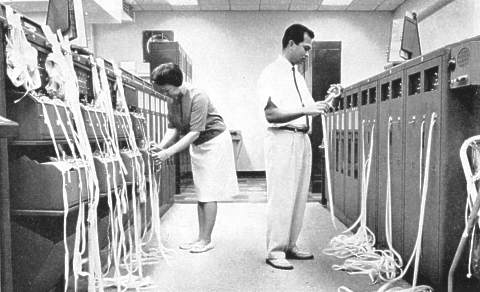
</div>

Paper tape stored one character per punched row.

Its capacity depended on the tape length and coding system (from 5 to 8 holes per row).

1 meter of 8-hole tape, would store 394bytes, 100meters 39.4kB, 1km 394kB

---

## Paper tape (1940s-1970s)

<div class="container-images">


</div>

To **store** an average Spotify song (3.5 minutes, 8.4MB):

with a 8-holes tape, it would require **21.3km** of tape, weighing about **33kg**

It would have taken about **7h 47 minutes** to load it into a computer

---

## Magnetic Core Memory (1950s–1970s)

<div class="container-images">
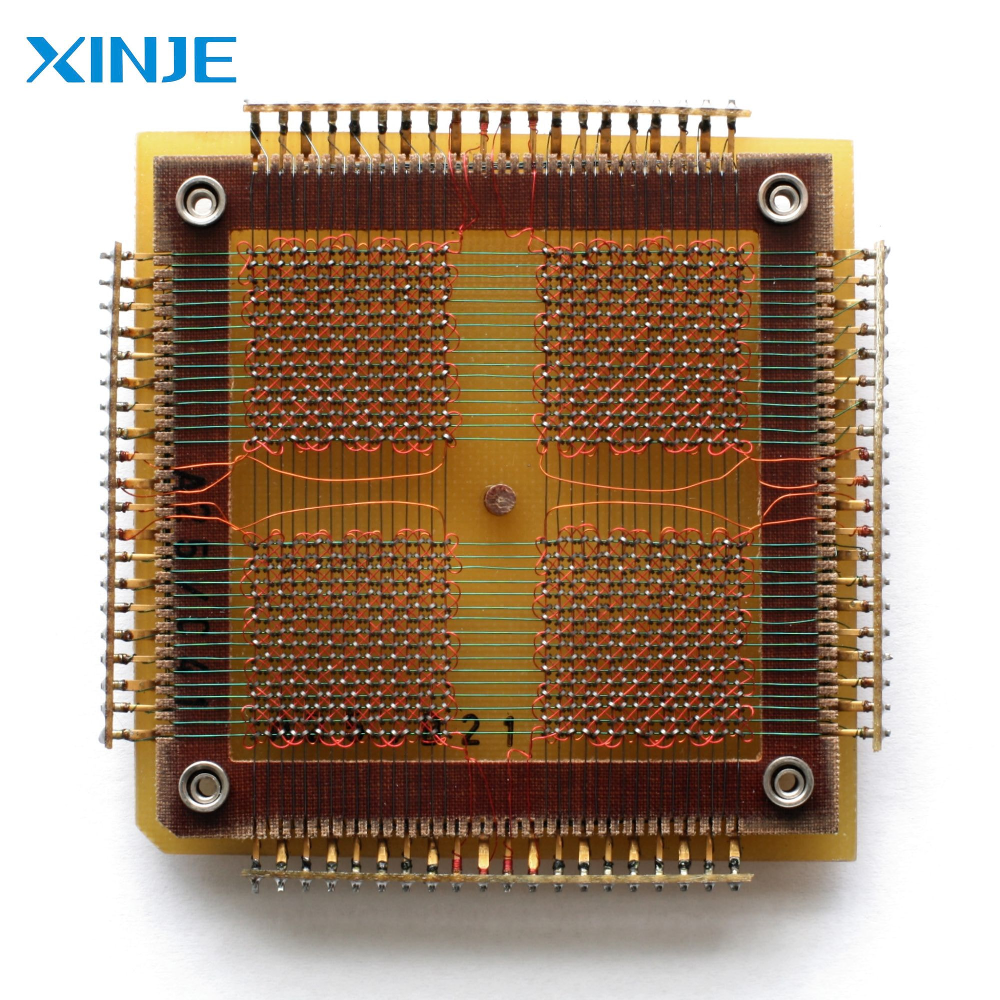
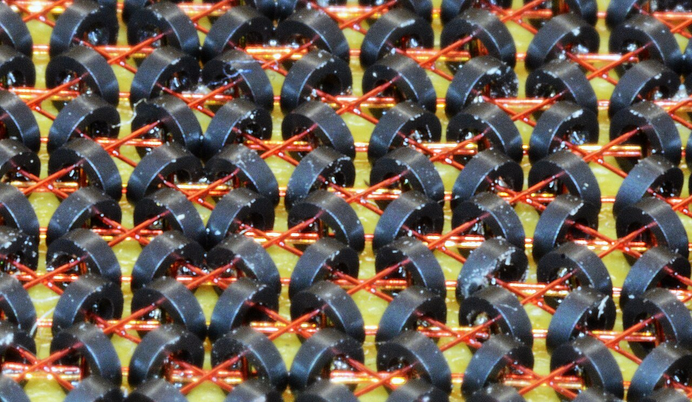
</div>

Magnetic-core memory stored **one bit** per **ferrite core**

The *Appolo Guidance Computer* that went to the moon in 1969, had **35'840 ferrite cores**

In the late 1970s systems, the capacity was several MegaBytes of memory (millions of ferrite cores)

---

## Magnetic tape (from 1950s)

<div class="container-images">


</div>

Cheap sequential storage for data storage and backups

Sequential means that to access the data, the tape has to be rewind to the desired data position

The first tape reels could store about 3MB each, today up to 90TB each (about 30millions times more)

---

## Magnetic tape today

<div class="container-images">
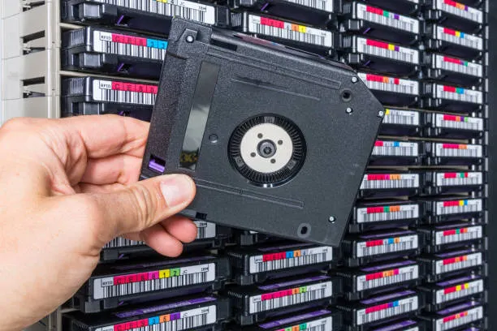
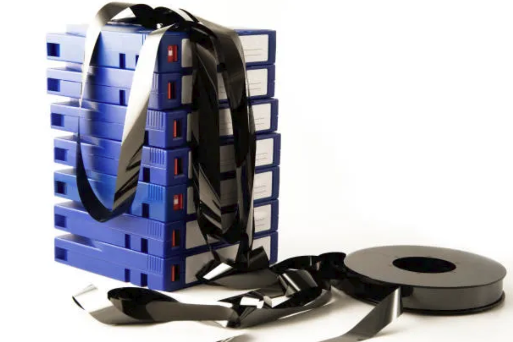
</div>

Today it is still the most common long-term backup solution for datacenters.

It is still the cheapest and very realiable solution long-term.

The latest version of the current tapes (LTO-10) can store up to **90TB of data per tape**.


---

## Hard disk drives (HDDs) (from 1956)

<div class="container-images">
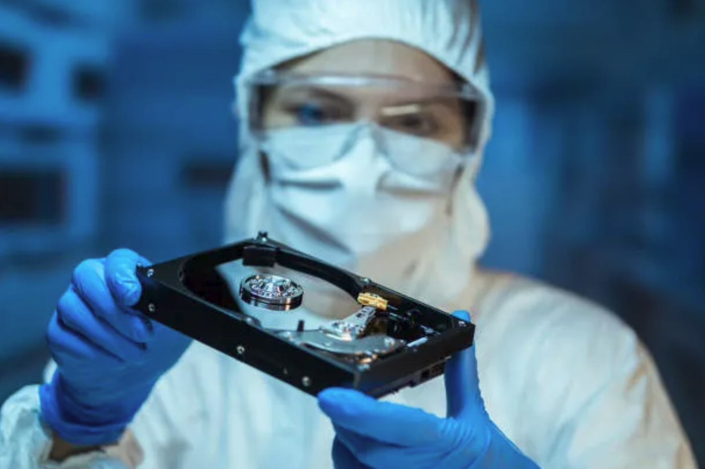
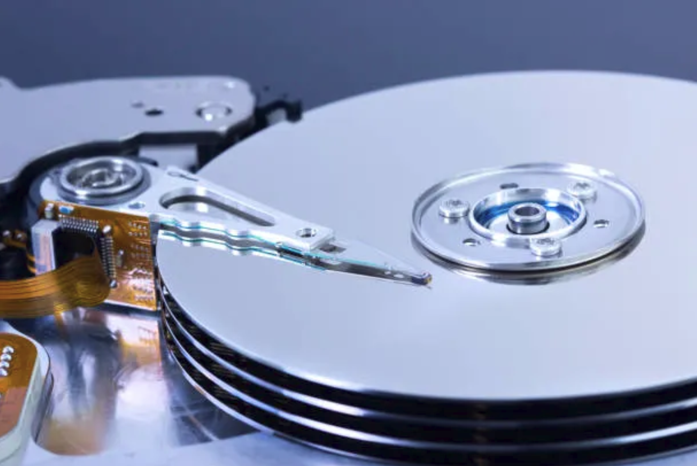
</div>

The first HDD build by IBM in 1956 had a capacity of 3.75MB

Today commerical HDD have a capacity up to 36TB (about 10millions times more)

They provide big storage capacity and faster random data access compared to magnetic tapes


---

## Floppy disks (1970s–1990s)

<div class="container-images">

</div>

Portable magnetic storage

The main formats over time were: 8"/20cm (1.2MB), 5.25"/13cm (1.2MB), and the 3.5"/9cm (1.44MB)

To store a Spotify song (8.4MB), you would need **6 disks of 1.44MB floppy disks**

To transfer the song to the computer, it would take about **5 minutes**

---

## Optical disks (from 1980s)

<div class="container-images">
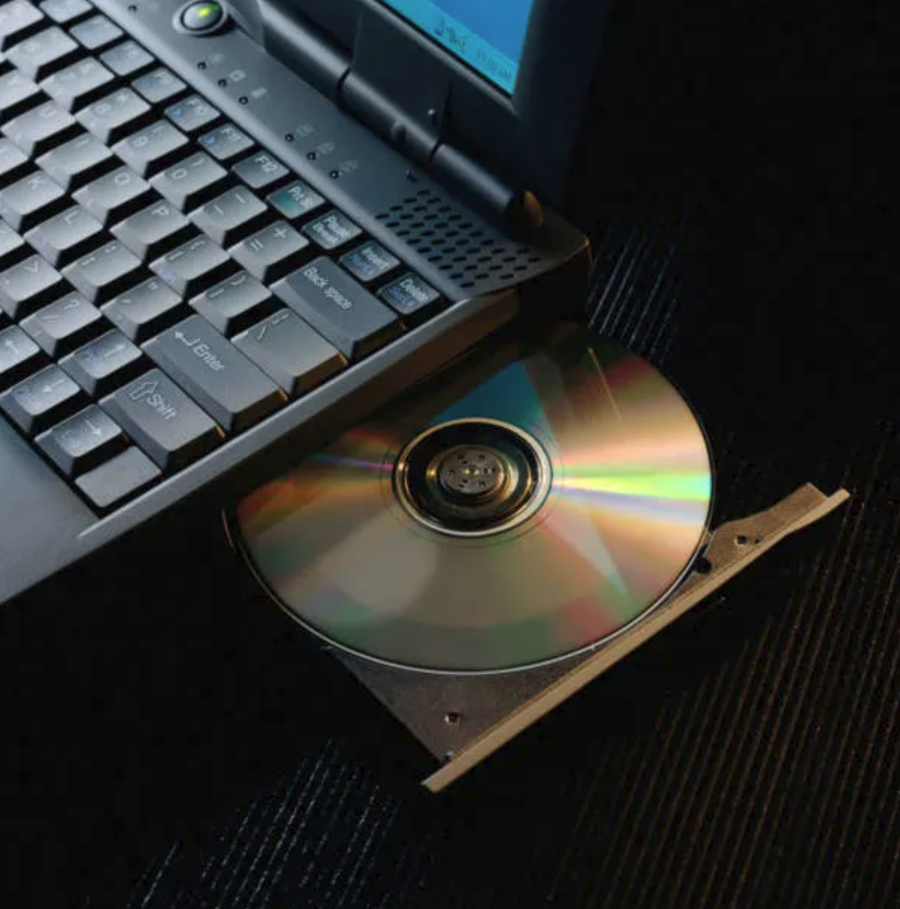
</div>

Optical discs store data using a laser that reads microscopic pits and lands

CD-ROM (from 1985): 700MB, DVD (from 1996): 4.7GB, Blue-ray (2006): 25GB-128GB 

---

## Flash-based storage (from 2000s)

<div class="container-images">
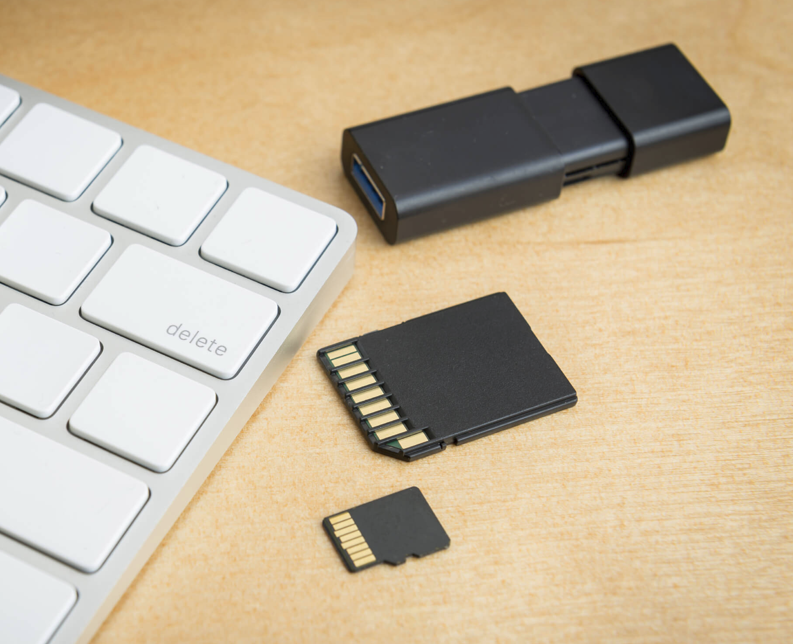
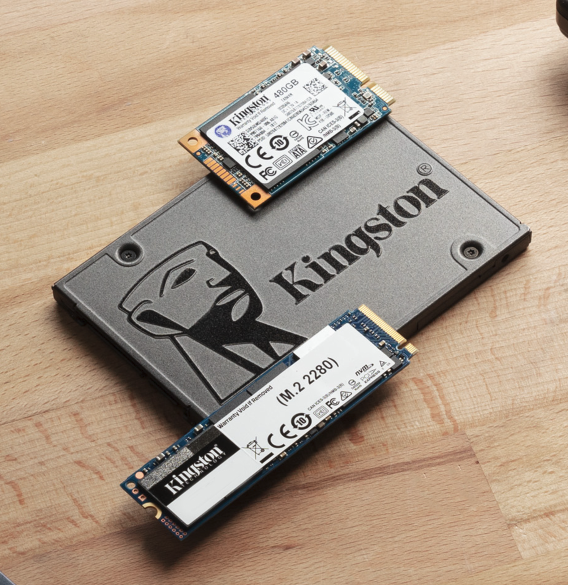
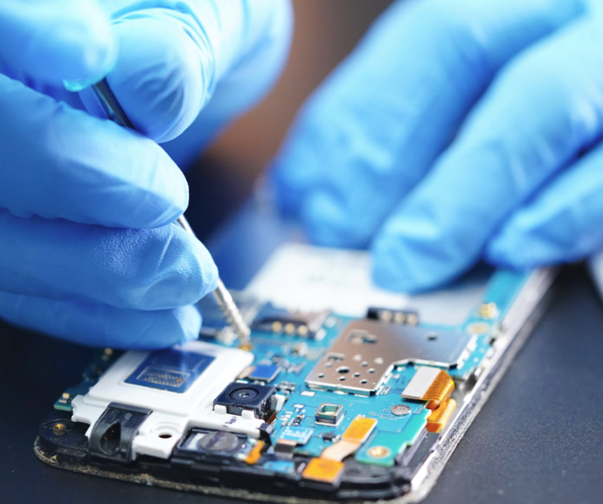
</div>

USB drives, memory cards, SSDs (Solid State Disk), smart devices, all use NAND flash memory

There are no moving parts, making them faster and more durable than HDDs

The data storage capacity is up to varius TBs with very fast reading and writing performances

---

## Cloud storage (from 2010s)

<div class="container-images">
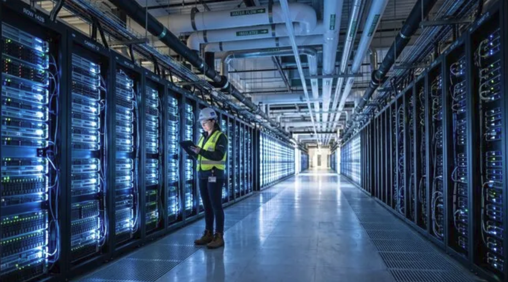
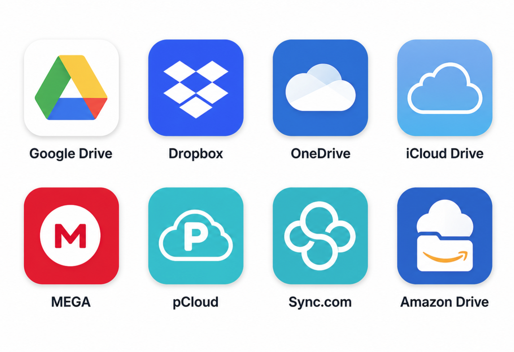
</div>

Data are stored on remote data centers and accessed online

The devices that stores data are still HDDs, SSDs and magnetic tapes for backups

Data are **not anymore physcially with the user**, but remotely accessed
